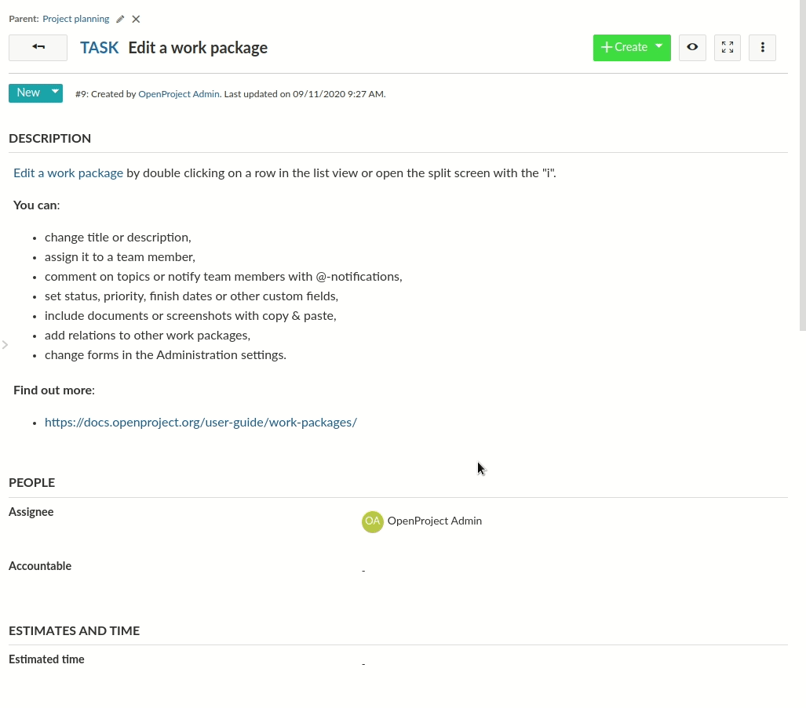

---
sidebar_navigation:
  title: Inline editing
description: Get an overview of how inline-editing of resources works
robots: index, follow
keywords: development concepts, inline editing, edit forms
---

# Development Concept: Inline Editing

Inline editing is a core functionality of work packages and other attributes. 



## Key takeaways

*Inline editing ...*

- wraps HTML or complex form elements (such as the WYSIWYG editor)
- has two modes: **Display** (inactive, show mode) and **Edit** (Active, input mode)
- uses a resource and its schema to determine what kind of form element to show
- can be used for work packages and other HAL resources that have a schema


## Prerequisites

In order to understand Inline Editing, you will need the following concepts:

- HAL resources

- Schemas

  


## Components overview

Inline-editing is usually connected to not only a single, but multiple fields of a resource. Each inline-editable field resides within a container that we call an `EditForm`. 


### EditForm

The `EditForm` logically groups together multiple field elements very similar to how a `<form>` tag encapsulates a set of inputs. It is tied to a (HAL) `resource` input.


 It has multiple responsibilites:

- receives registration of fields within the form
- knows which fields are currently actively editing
- handles submission of changes to the resource
- activates erroneous fields after unsuccessfully trying to saving.


### EditableAttributeField

The `EditableAttributeField` contains the logic to show the *display* and *edit* states of a single attribute for the resource. The field will try to register to a parent form by injecting it through its constructor. Only fields within an `EditForm` parent are editable.


### 🔗 Code references

- [`EditForm`](https://github.com/opf/openproject/blob/dev/frontend/src/app/modules/fields/edit/edit-form/edit-form.ts) base class
- [`EditFormComponent`](https://github.com/opf/openproject/blob/dev/frontend/src/app/modules/fields/edit/edit-form/edit-form.component.ts#L28-L27) Angular `<edit-form>` component 
- [`EditableAttributeFieldComponent`](https://github.com/opf/openproject/blob/dev/frontend/src/app/modules/fields/edit/field/editable-attribute-field.component.ts) Angular `<editable-attribute-field>` component for attributes within the edit form
- [`WorkPackageFullViewComponent`](https://github.com/opf/openproject/blob/dev/frontend/src/app/modules/work_packages/routing/wp-full-view/wp-full-view.html) Work package full view template that uses the `edit-form` attribute to create a form for the work package full view (as seen in the Gif above)
- [`ProjectDetailsComponent`](https://github.com/opf/openproject/blob/dev/frontend/src/app/modules/grids/widgets/project-details/project-details.component.html) Exemplary widget template that uses the form for project attributes


## Minimal example

The  [`ProjectDetailsComponent`](https://github.com/opf/openproject/blob/dev/frontend/src/app/modules/grids/widgets/project-details/project-details.component.html) is a very isolated example showing how to use the edit-form together with `EditableAttributeField` component to show the actual inline-editable field.


On the example of a work package, this following code snippet would create an edit form for a given work package resource and an attribute for the `subject` attribute of that work package.

```html
<edit-form *ngIf="workPackage" [resource]="workPackage">
    <editable-attribute-field [resource]="workPackage"
                              fieldName="subject">
    </editable-attribute-field>
</edit-form>
```


While this doesn't take care of any labels or styling, it will already provide error handling for the given field and allow proper saving of the changes to the resource.


## Discussions

- The `EditForm` has a similar responsibility to what Angular offers with the `FormGroup/FormControl` logic of the reactive forms module. It would be useful to evaluate the possibility and effort to refactor the edit form into such a behavior. Currently, as the table is rendered in plain JavaScript and relies on the edit form, this may not be possible.