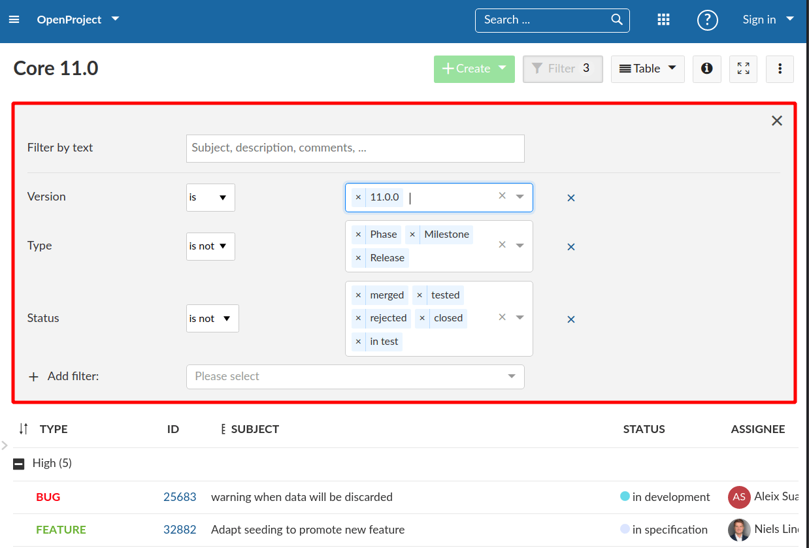
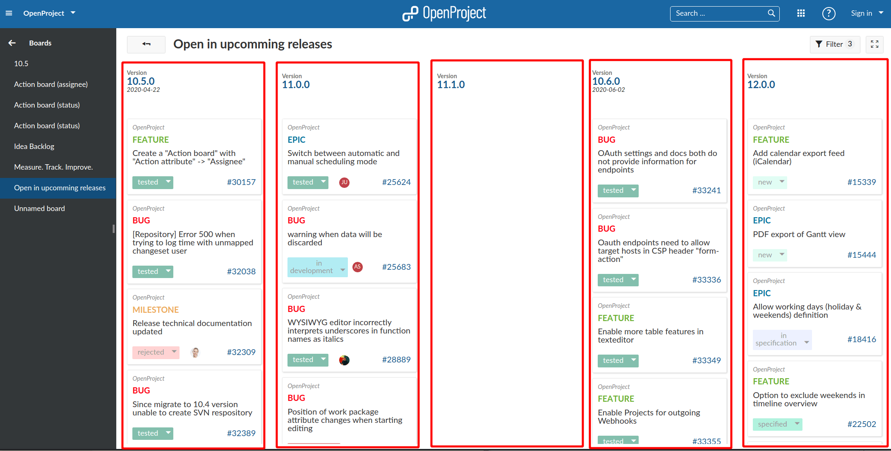

---
sidebar_navigation:
  title: Queries
description: An introduction to queries in OpenProject and their use in the frontend
keywords: queries, query space, work package views
---


# Query

The Query object is the concept of holding the configuration for a specific work package view as well as computing and outputting its results.  They are fundamental building blocks in OpenProject and used in many modules (Work packages, BIM, boards, timeline, embedded tables).  Their flexibility allows for building complex features with relatively little effort on the backend side. For an OpenProject developer who wants to improve or create new features it is fundamental to understand how queries work.

Most of the communication in OpenProject is organized in work packages. Work packages are managed and displayed in many different places, such as the work package table in the *Work packages* module, or as cards the *Boards* module, within the *Calendar* or in *My page* widgets, such as charts for instance. Even the list of child work packages within a work package is a query.

For the work packages table, the query object holds the way the table displays (selected columns, display mode) as well as what data it contains (filters, sort criteria).

A query can be persisted by a user or created dynamically through a set of parameters. It can be published and shared with other users of the project or application.


## Key takeaways

*Queries ...*

- are configuration objects for both the *displaying logic* and the *data logic* of (primarily) work packages and other resources
- can be saved to the database connected to a user, privately or publicly accessible
- can be created on the fly through URL / body parameters
- can be requested through the APIv3 to get the resulting resources collection of the query in a paginated way


## Prerequisites

The following guides are related:

- [HAL resources](../hal-resources)

- Backend API overview


## Query definition

A query is an object that revolves about two types of information:

1. The configuration needed to fetch data from the database (filters, sort criteria, grouping criterion etc.)
2. The way the results retrieved from the database with the above filters are displayed (set of visible columns, highlighting, display mode of the work package table, etc.)

Currently, the Queries endpoint and object is highly specific to work packages, but this is bound to change with more resources becoming queryable. For some other resources such as projects, queries already exists in the backend, but not yet in the frontend application.


## API Backend

Queries are regular APIv3 grape endpoints that can be accessed through the `/api/v3/queries` namespace. In general, they can be maintained in two ways:

1. By accessing a previously saved query by their ID such as `/api/v3/queries/2453` ([Example JSON response](https://community.openproject.com/api/v3/queries/2453) on community)
2. By setting dynamic GET parameters on a saved or `default` query such as `/api/v3/queries/default?columns[]=id` ([Example JSON response](https://community.openproject.com/api/v3/queries/default?columns[]=id) on community)

The default query `/api/v3/queries/default`  and `/api/v3/:project_id/queries/default` contains a default set of configuration (back-end and front-end) global and for the given project, respectively. They can only be modified administrators through some global settings.

A number of parameters can be passed to the Query through parameters as elaborated on in [the APIv3 Queries documentation](../../../api/endpoints/queries/).

Clients can define a query once, save it and use it later on to load the same set of filters, columns, and so on. When retrieved from the database (a query id is passed), the query has been previously stored. Saved properties may be overridden through URL parameters, which override the existing saved query.


### Query collections responses

Since queries can be saved and should be listed to the user such as in the work package sidebar, they can also be requested as a collection of resources through `/api/v3/queries`.  This endpoint can also be filtered. For more details on that, see the [respective APIv3 Queries filtering section](../../../api/endpoints/queries/#filtering).

This response will end up representing the available queries on the `work packages` module sidebar as shown below.


### Query resource HAL+JSON response

When accessing a singular query resource, the response will always contain the same set of properties:

- **Basic properties** of the query object itself
  - `id` of the query (if any)
  - `name` of the query set by the saving user
  - `starred` whether the user favorited this query (special place in sidebar)
  - `public` whether the query is shared with other users
  - `createdAt` / `updatedAt` timestamps for the resource
  - `_links.project` to the project it is saved in (if project-scoped)
  - `_links.user` reference to the user that saved or requested the query
- Properties regarding the **displaying of the query** results such as `timelineVisible` (show the gantt chart), `highlightingMode` and `showHierarchies`
- **Embedded HAL links**  and `_embedded` related to how the results are to be fetched
  - `filters` selected filters array
  - `columns` embedded array of selected `columns`
  - `sortBy` array of one or multiple sort criteria.
  - `groupBy` (optional) information on whether results are aggregated into groups
- **Results** of work packages embedded in `_embedded.results`, showing the total number of matched results, as well as including the requested _page_ of results. The results will contain work package resources and the schema objects necessary to render them to reduce requests.

### Filtering

A major, but complex functionality of the query is the `filters` object to determine what results should be shown. For the user, these filters are shown for example above the work packages table after opening through the *Filter* button.




These filters are also saved within the queries. Read the [APIv3 filters documentation guide](../../../api/filters/) to know more about how filters and their syntax work.


### Exemplary query response

Due to the public nature of the OpenProject community, you can check out the following exemplary query response in HAL+JSON: [community.openproject.com/api/v3/queries/2453](https://community.openproject.com/api/v3/queries/2453)

It returns a saved query for the OpenProject 11.0 release, with a type filter `type is not [Idea, Phase, Release]` , a version filter `version = 11.0.0` and a "show all subprojects" filter with `subProject = all` . It is sorted by `type ascending`.

The resulting work packages will differ based on the visibility of the work packages and your permissions in the projects. For more information, check out [the concept on permissions](../permissions).


## Frontend usage

As the singular Query JSON object encompasses a large amount of different concerns, the frontend splits this resource up into quite a substantial amount of services for isolating the individual behaviors.

This guide will not go into too much detail on the actual components using these services, as they will be subject to change and detailed in another guide.


### Isolating query spaces in the frontend

The work packages module can load multiple queries on a single page. If for example, you open a query and a work package with an embedded table showing (such as showing related or child work packages), the application will request and render two queries and work package tables.


This can happen several times on other pages too. For example, the board page will load one query per activated column:



Each of these queries need their own set of services for handling selected filters, sort criterion and other view related data.

To properly isolate this data, the application has the concept of an [`IsolatedQuerySpace`](https://github.com/opf/openproject/blob/dev/frontend/src/app/features/work-packages/directives/query-space/isolated-query-space.ts) and associated `IsolatedQuerySpaceDirective`, which is an Angular directive that provides a query space (a store object) to its DOM children. This uses the Angular hierarchical injectors functionality, [which you can read up on here](https://angular.io/guide/hierarchical-dependency-injection).

The `IsolatedQuerySpace` has individually accessible states for every part of the query resource, such as `filters` , `columns`, `groups`, and so on.

Additionally, the logical parts of the query are encapsulated into view services that components of the table can use to modify and update data in the frontend, before saving the query back to the API.

These states are being initialized in the [`WorkPackagesInitializationService`](https://github.com/opf/openproject/blob/dev/frontend/src/app/features/work-packages/components/wp-list/wp-states-initialization.service.ts) for the current isolated query space whenever a query is loaded through the designated services. The important services are:

- `WorkPackageViewFiltersService` for manipulating, adding, and removing filters of the query
- `WorkPackageViewColumnsService` for adding, moving, or removing columns and getting available columns for selection
- `WorkPackageViewSortByService` for getting and updating the sort criteria object of the query
- `WorkPackageViewGroupByService` for getting and updating the grouping property of the query
- `WorkPackageViewTimelineService` for identifying and modifying whether the timeline is visible in the table, and what settings it has
- `WorkPackageViewHierarchiesService` for manipulating the visible hierarchies in the table and temporarily storing what hierarchies are being shown or collapsed.

There are additional services for handling pagination and other parts of the query that can be controlled individually.

Whenever the frontend updates a state of these services, the original query _may_ be updated due to change observers in the [`WorkPackagesViewBase`](https://github.com/opf/openproject/blob/dev/frontend/src/app/features/work-packages/routing/wp-view-base/work-packages-view.base.ts) component. They will end up updating the query resource, and in turn updating the view services again. However the frontend will never directly modify the query resource itself to preserve one way data flow.

### Loading queries with WorkPackagesListService

First, you'll need to get hold of a query resource by loading it from the API. This is done through the [`WorkPackagesListService`](https://github.com/opf/openproject/blob/dev/frontend/src/app/features/work-packages/components/wp-list/wp-list.service.ts). It handles streaming of requests through RXJS observables and initializing all the necessary services of the query space.

The easiest use case is loading a query from its saved `id` property. This would work as follows:

```typescript
const wpList = injector.get(WorkPackagesListService);
wpList
  .fromQueryParams({ query_id: 1234 })
  .subscribe(query => console.log(query.results.count))
```

In practice, you will likely not only access the query resource itself, but rather one of the many `WorkPackageView*Service` view services to control `filters` and other properties.

The `WorkPackagesListService` can also update and save existing queries passed to it. This flow will often happen in the [`PartitionedQuerySpaceComponent`](https://github.com/opf/openproject/blob/dev/frontend/src/app/features/work-packages/routing/partitioned-query-space-page/partitioned-query-space-page.component.ts), which is the basis for the modules showing work packages as a table or grid such as the [`WorkPackageViewPageComponent`](https://github.com/opf/openproject/blob/dev/frontend/src/app/features/work-packages/routing/wp-view-page/wp-view-page.component.ts) or the [`IfcViewerPageComponent`](https://github.com/opf/openproject/blob/dev/frontend/src/app/features/bim/ifc_models/pages/viewer/ifc-viewer-page.component.ts).

`PartitionedQuerySpaceComponent` instances will be instantiated by the router and listen to URL params to load the corresponding query object. The most prominent example of such a page is the work packages module such as [community.openproject.com/work_packages](https://community.openproject.com/work_packages).

The partitioning comes from showing a work package table (or cards view) on one side, and a details view of a single work package on another side, splitting the page in two. The width of the split areas can be customized by the user through a drag-handle.
