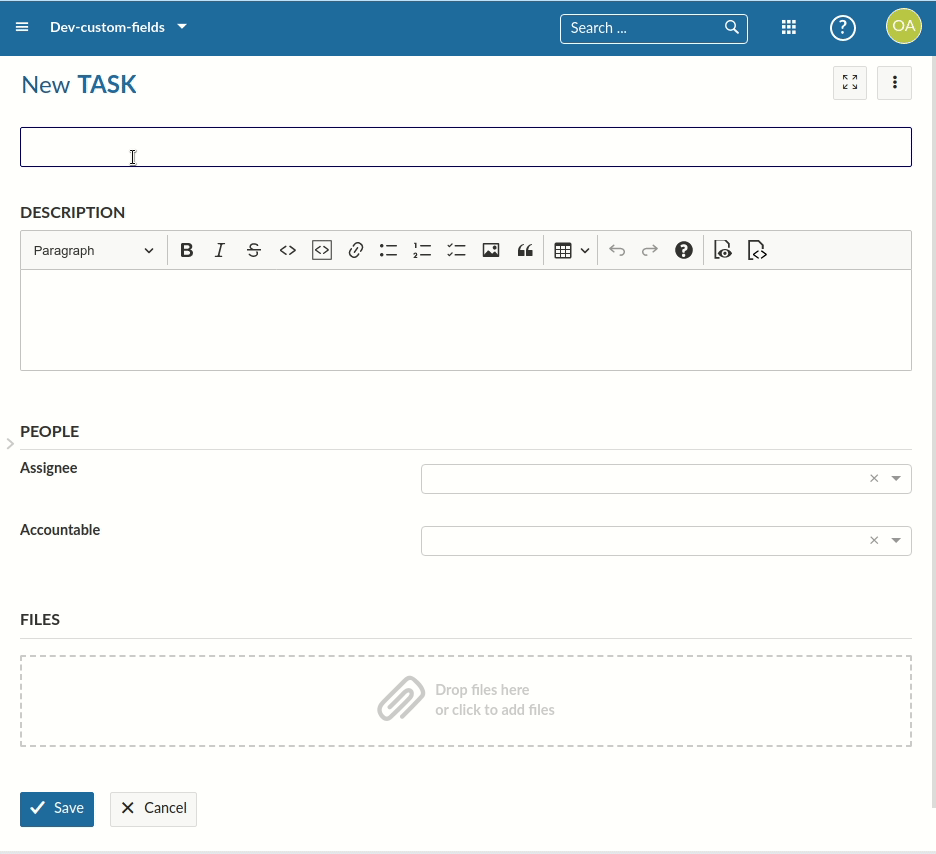

---
sidebar_navigation:
  title: Resource changesets
description: Get an overview of how frontend changesets work when editing hal resources
robots: index, follow
keywords: changesets, editing, HAL resources
---

# Development Concept: Resource changesets

Resource changesets allow to edit resources in a transparent way, tracking its changes and saving the change to the API.

## Key takeaways

*Changesets ...*

- are created temporarily when editing HAL resources such as work packages
- contain an isolated object of changes to apply when the resource is saved
- provide a `Proxy` javascript object `projectedResource` to the resource with the changes applied
- encapsulates a temporary schema and form resource for accessing newly added fields and errors


## Prerequisites

In order to understand Inline Editing, you will need the following concepts:

- [HAL resources](../hal-resources)

- [Schemas](../resource-schemas)


## Classes overview

Let's go over the classes and services used to provide access to changesets.


### ResourceChangeset

The `ResourceChangeset` class is a temporarily created class whose lifetime is determined by the editing duration of a user to a resource such as work package. It gets created automatically when rendering inline-editable fields and is reset/destroyed/reinstantiated when a change has been submitted to the backend, or when the changes are cancelled.

The changeset maintains references to

 *  - The source HAL resource (a pristine, unchanged version) such as a work package
 *  - The actual `Changeset` object of changes (basically a map of `attribute -> values` of changes)
 *  - The `FormResource` for the resource (due to temporary changes such as switching types or projects in work packages)
 

The changeset provides a high level access to getting and writing changes as well as caching resources around editing to avoid reloading them too often. It also provides access to a `projectedResource`, which is a proxy class on the HAL resource with all overridden values returned from the changeset. It behaves as if the modified resource was saved and returned.

The ResourceChangeset is possibly subclassed for specific HAL resource types. For example, by the `WorkPackageChangeset`, a resource changeset specifically for work packages to correctly handle cases like switching types or projects - which will require in a reloading of the `FormResource` and its embedded schema for identifying and showing new attributes.


### HalResourceEditingService

In order to *create*, *remove* or *saving* changesets for a specific resource, the `HalResourceEditingService` is provided at various hierarchies of the application. The service maintains a store of available resource changesets, whose states and changes can be observed with an RXJS observable.

The main entry point for editing changesets is `HalResourceEditingService#changeFor`, which will either continue editing an existing changeset, or create a new one for the given class.


#### Minimal example on using the changeset

```typescript
const halResourceEditingService = injector.get(HalResourceEditingService);
const workPackage = /** provided by e.g., an input */

// Open a new changeset
const changeset = halResourceEditingService.edit(workPackage);

// Did we make any changes so far?
console.log(changeset.isEmpty()); // true

// Update a value to the changesets
changeset.setValue('subject', 'My new subject');

console.log(changeset.isEmpty()); // false
// Access current changes
console.log(changeset.changes); // { subject: 'My new subject' }
// Access current and previous values
console.log(changeset.changeMap); // { subject: { from: 'Old subject', to: 'My new subject' } }

// Apply the changeset for the work package
const payload = changeset.buildPayloadFromChanges() // { lockVersion: 1, subject: 'My new subject'};

// Access the same changeset
const changeset2 = halResourceEditingService.changeFor(workPackage);
console.log(changeset2 == changeset) // true


// Reset the change
changeset.clear();
console.log(changeset.isEmpty()); // true
console.log(changeset2.isEmpty()); // true
```


#### Saving the changeset

In order to save a changeset, you would simply pass it to `HalResourceEditingService#save`. This will save the changes to the APIv3 and update the resource. It returns a `ResourceChangesetCommit` which is a reference to the changes and resulting resource.


You will often see other components pushing into the changeset, such as the `EditFieldComponent`. To find out more about the inline editing functionality, see [this guide](../inline-editing).


#### Temporary editing resources

Some components such as the `WorkPackageSingleView` needs to update the view upon changes to a resource under edit. A prominent, but complex example is the work package gaining or losing attribute fields due to the `Type` or `Project` being changed. This is due to custom fields being configurable on a per-project level.

Assume you start creating a new work package of type `Task`, and then switch to a `Feature` which has an additional custom field. Even before saving the work package, you would expect this custom field to become available. The following GIF shows this behavior in both creating and editing a work package:



For this to work, the `WorkPackageSingleView` needs to have acecss to the work package *as if it was saved* after the type was changed. But the work package is a new resource and not yet actually saved. That's why `HalResourceEditingService#temporaryEditingResource` returns an observable state that returns either the pristine work package, or the proxied work package by the changeset to transparently access the modified-yet-unsaved work package resource.


## Additional resources

Changesets are used in several components throughout the application. Notable examples are the [inline editing `EditForm`](../inline-editing).


