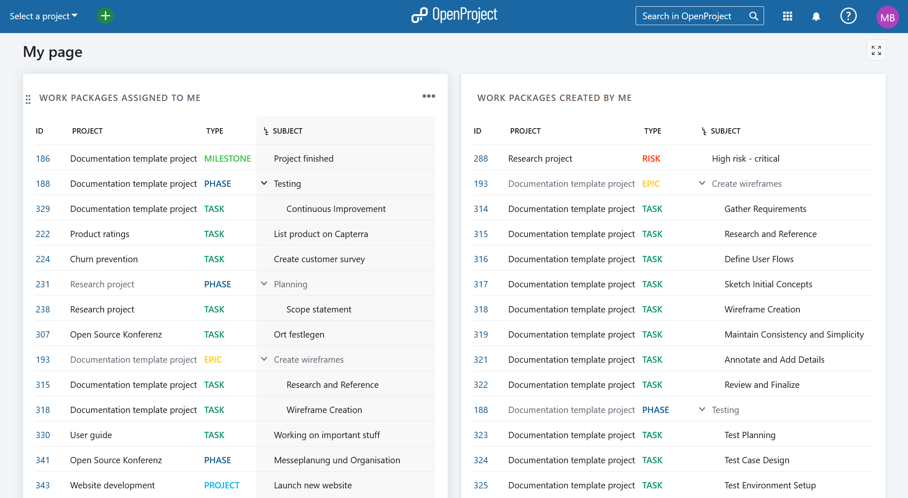
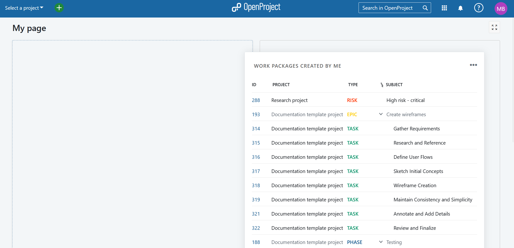
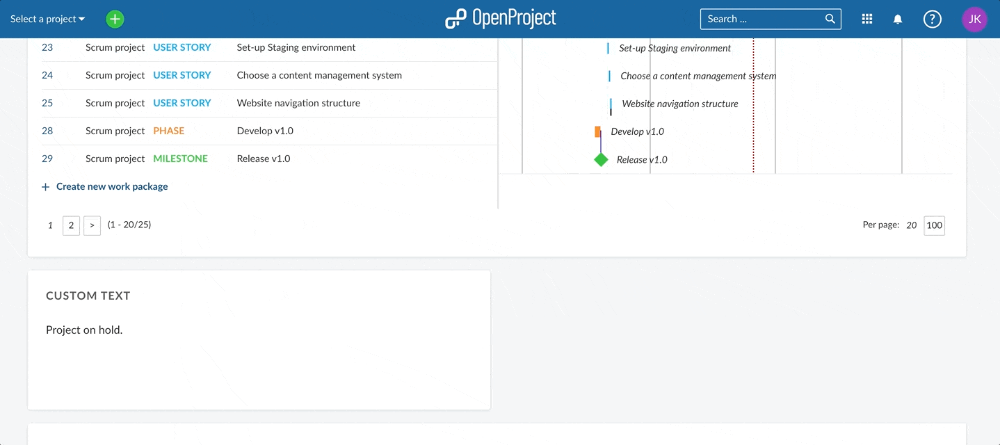
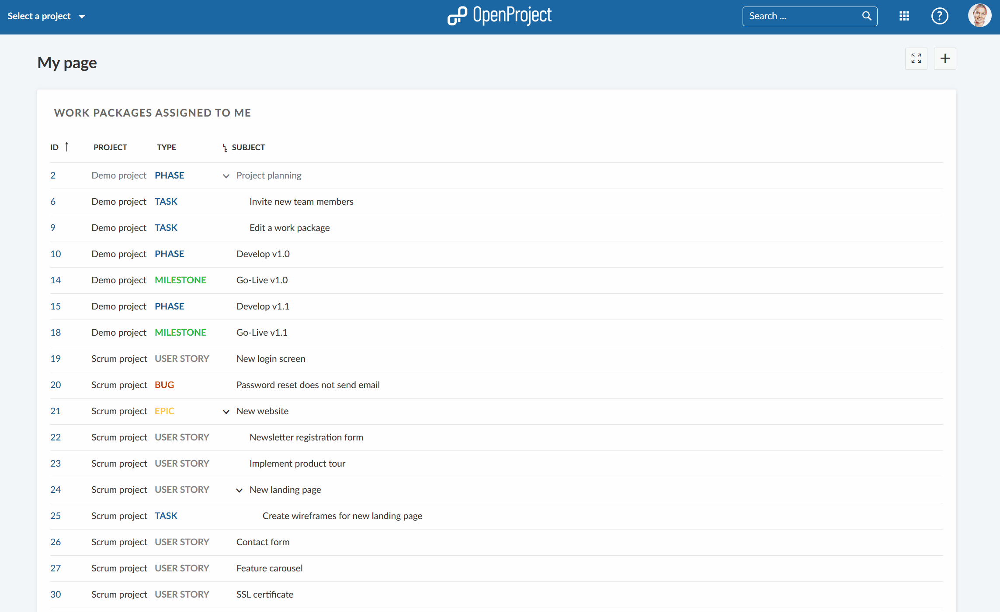
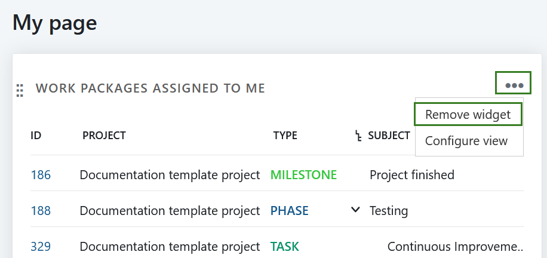

---
sidebar_navigation:
  title: My Page
  priority: 300
description: My Page in OpenProject - your personal dashboard
keywords: my page, personal overview page, dashboard
---

# My Page

The My Page is your **personal dashboard** with important overarching project information, such as work package reports, news, spent time, or a calendar. It can be configured to your specific needs.

| Topic                                           | Content                                    |
| ----------------------------------------------- | ------------------------------------------ |
| [My Page introduction](#my-page-introduction)   | What is My Page and what can I do with it? |
| [Configure the My Page](#configure-the-my-page) | How to add and edit widgets on My Page?    |
| [My spent time widget](#my-spent-time-widget)   | How to track spent time on My Page?        |

## My Page introduction

My Page is your personal dashboard where you can display important information of your projects. This personal dashboard contains information from all your projects. **My page** can be configured according to your preferences. You can include project information, for example the latest news, work packages assigned to you or reported work packages.

You can open your **My page** by clicking on your user avatar in the upper right corner and then selecting **My page** from the dropdown menu.

As a default, you will see two lists of all **work packages assigned to you** and **work packages created by you** from all your projects.

## Configure the My Page

### Add widgets

In order to **add a widget to My Page**, press the **+** icon on the top right corner of the page.

The dashboard shows the places where it is possible to add more widgets by displaying **+** icons.

Press a plus icon to add a widget to My Page at the according place.

Once you have chosen the place where to add the new widget on My Page, you can choose from a number of different widgets that can be included on your dashboard.

For a **detailed explanation of the widgets**, visit the section in the [project overview](../../user-guide/project-overview/#available-project-overview-widgets).

### Change position of the widgets

You can change the position of a widget on the dashboard with drag and drop.

Click the dots next to the title and drag it to the new place.

### Change the size of a widget

If you click the dots on the lower right hand corner in a widget you can change the size of a widget by pulling the widget left and right, up and down with the mouse.

### Configure the view of a widget (for work package tables)

You can configure the view of a work package widget to have the information included that you need.

**Work package** is a subset of a project that can be assigned to users for execution, such as Tasks, Bugs, User Stories, Milestones, and more. Work packages have a type, an ID and a subject and may have additional attributes, such as assignee, responsible, story points or target version. Work packages are displayed in a project timeline (unless they are filtered out in the timeline configuration) - either as a milestone or as a phase. In order to use the work packages, the work package module has to be activated in the project settings.

          

On a work package widget, click on the button with the three dots and select **Configure view...**

You can configure the work package table (e.g. filter, group, highlight, sort) according to the [filter, sorting and grouping criteria for work packages](../../user-guide/work-packages/work-package-table-configuration/). 

### Remove a widget

To delete a widget from the dashboard, click on the three dots in the upper right corner of the widget and select **Remove widget**.

## My spent time widget

To track spent time, [add the **My spent time** widget](#add-widgets) in the My Page.

You can directly create new time entries by clicking on the day, change the date with drag and drop, edit or remove time entries.

Watch the short video to see how to activate the spent time widget, add spent time, edit spent time (e.g. change the date or work packages or change the time booked) and delete spent time.

