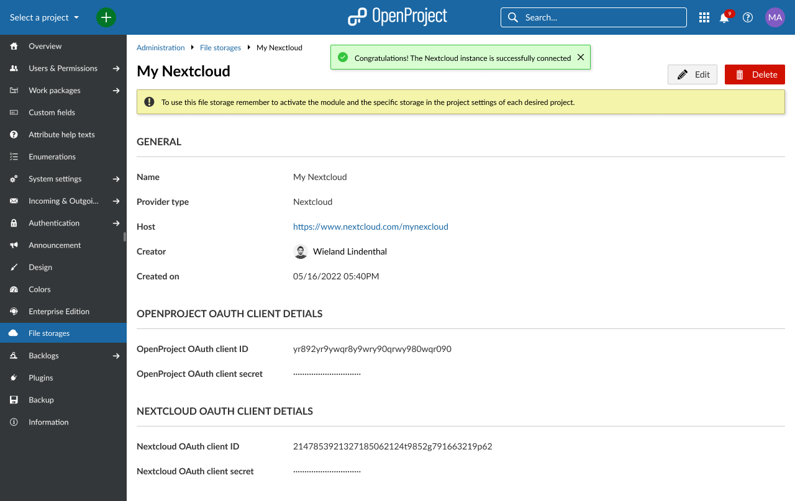

---
sidebar_navigation:
  title: Nextcloud integration setup
  priority: 600
description: Nextcloud integration setup
keywords: integrations, apps, Nextcloud
---

<<<<<<< Updated upstream
# Nextcloud integration setup 
=======
# OpenProject and Nextcloud integration setup 
>>>>>>> Stashed changes

The OpenProject and Nextcloud integration will improve the productivity of all the users. It combines the strengths of the market leading content collaboration platform Nextcloud and the leading open source project management software OpenProject.

The integration enables users to keep an eye on ongoing project activities directly in their Nextcloud instance and link their Nextcloud files to OpenProject work packages. To learn more about how to use the integration go to the [Nextcloud user guide](../../../user-guide/nextcloud-integration/)

## Step by step setup instructions

The integration is available starting with Nextcloud 20 and OpenProject 12.2. To be able to configure this integration you need to be an administrator in both Nextcloud and OpenProject.

**1. Add OpenProject integration app and connect the instance** -  in Nextcloud

To activate your integration to OpenProject in Nextcloud, navigate to the built in app store under your user name in Your apps. You can use the search field in the top right corner to look for the OpenProject integration. Click the button Download and enable.

Once the OpenProject integration app is downloaded an enabled you can access it trough the lateral menu and set the OpenProject host with the desired instance.

Click on the "Save" button and open a new tab with your OpenPoject instance.

**2. Introduce the basic information of your integration** - in OpenProject

As an administrator, in the new browser tab please open the File storages from the Administration page. To start with the configuration of your new Nextcloud integration click on the "+" button to add a new storage.

By default the storage **provider type** is set to Nextcloud and this doesn't need to be modified. To proceed, you need to set a **name** to your Nextcloud integration which will be displayed to all the users using it, it is highly recommended to give a name that allows you to differentiate it from other file storages integrations. Also, to be able to use the integration you also need to add the **host url** to nextcloud including the https://.

Once all the mandatory fields are filled please click on the "Save and continue setup" button.

**3. Generate and copy the OpenProject OAuth values** - in OpenProject and Nextcloud

In this step the OpenProjects OAuth values are generated automatically. This values are the ones that will allow the connection From OpenProject to Nextcloud, therefore you need to copy them by opening again the Nextcloud integration window (without closing the OpenProject one) and pasting the values in the step 2 "OpenProject OAuth settings".

**IMPORTANT NOTE:** The information OpenProjects OAuth values (client ID and client secret) are not accessible again after you close the window. Please make sure to copy the values in the Nextcloud OpenProject Integration settings.

Once you have copied the values, click on the "Save" button to proceed to step 3 in Nextcloud.

**4. Generate and copy the Nextcloud OAuth values** - in Nextcloud and OpenProject

As in the previous step the OAuth values are generated automatically, but this time the Nextcloud OAuth are created in the step 3 of the Nextcloud OpenProject Integration settings. This values are the ones that will allow the connection From Nextcloud to OpenProject, therefore, again, you need to copy them but this time from Nextcloud to OpenProject (without closing the Nextcloud one). If you haven't clicked on the "Done. Continue setup" button from the previous step, now you can click it to see the screen where you will be able to paste the Nextcloud OAuth values.

Once the values are copied you can click the button "Save and complete setup" in the OpenProject window and the "Yes, I have copied these values" in the Nextcloud window. Once this is done your instance configuration will be completed.

**5. Enable the file storages module and activate it in the desired project** - in OpenProject

Now the integration setup is complete and ready to use, but as administrator you still need to activate the file storages module and specify in which projects you need the file storage integration that you just set up.

To activate the module please go to the Project settings in the desired project and access the Modules menu entry in the side menu, there you can activate the module "File storages". Once this is done a new lateral menu entry called "File storages" at the bottom of the menu where you can select which file storage integration you want to activate in this project.

## How to reset your OAuth values

If as an administrator you need to reset the values of the Nextcloud integration you can always reset the OAuth values from both sides of the integration by editing the setup of the already set up integrations and using the "Reset OAuth values" or "Replace OAuth values" buttons.

**IMPORTANT NOTE:** When you reset/replace this values you will need to update the specific settings with the new OAuth credentials from the side you are reseting. Also, all users will need to re-authorize access to their OpenProject or Nextcloud account.

## How to delete a file storage integration

As administrator you can always delete the integration to Nextcloud using the "Delete" button in OpenProject or the "Reset" button in Nextcloud settings.

**IMPORTANT NOTE:** If you perform this action the integration will be reset/deleted so all the settings and user connections created will be deleted. In case you want to reconfigure it you will need to do the complete setup process again.