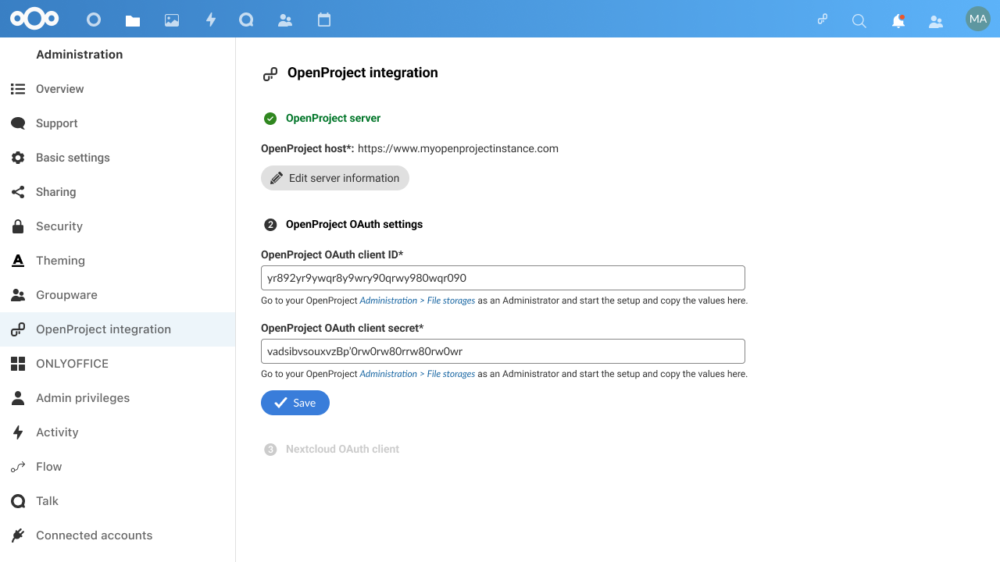
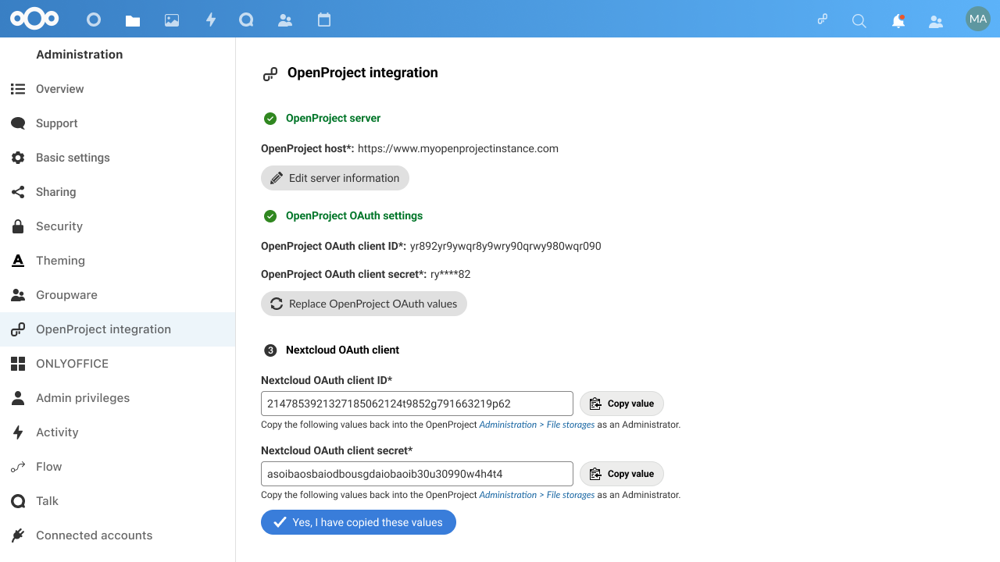
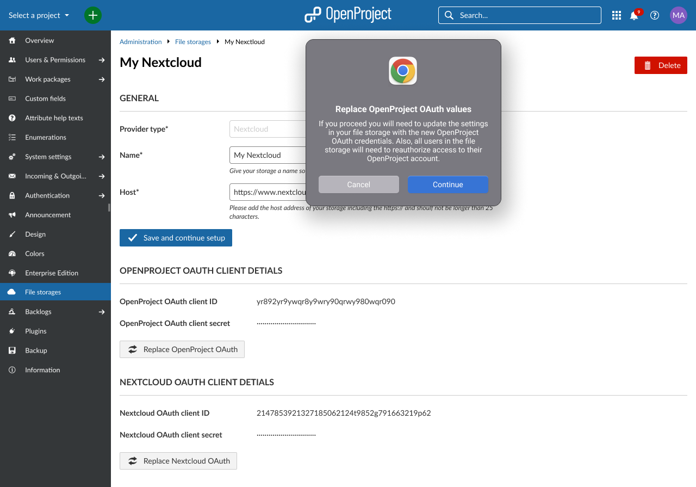

---
sidebar_navigation:
  title: Nextcloud integration setup
  priority: 600
description: Nextcloud integration setup
keywords: integrations, apps, Nextcloud
---

# OpenProject and Nextcloud integration setup 

The integration between OpenProject and Nextcloud has the potential to improve the productivity of all users. It combines the strengths of Nextcloud, the market-leading collaboration platform, and OpenProject, the leading open source project management software.

The integration enables users to keep an eye on ongoing project activities directly in their Nextcloud instance and link their Nextcloud files to OpenProject work packages. To learn more about how to use the integration, please refer to the [Nextcloud user guide](../../../user-guide/nextcloud-integration/)

## Step-by-step setup instructions

The integration is available starting with Nextcloud 22 and OpenProject 12.2. To be able to configure this integration, you need to be an administrator in both Nextcloud and OpenProject instances.

**1. Add the "OpenProject integration" app and connect the instance** - in Nextcloud

To activate your integration to OpenProject in Nextcloud, navigate to the built-in app store under your user name in _Your apps_. You can use the search field in the top right corner to look for OpenProject integration app. Click the button **Download and enable**.

Once the OpenProject integration app is downloaded and enabled, you can access it through the side menu and enter the host URL of your desired OpenProject instance.

Click on the **Save** button and open your OpenProject instance in a new tab.

**2. Introduce the basic information of your integration** - in OpenProject

Make sure you are logged in as an administrator in your OpenProject instance. Navigate to *File storages* from the Administration page. To start configuring your new Nextcloud integration, click on the **Add** (+) button to add a new file storage.

By default the storage **provider type** is set to Nextcloud; this does not need to be modified. To proceed, you give a **name** to your Nextcloud integration, which will be displayed to all the users using it. We highly recommended giving a clear and distinct name that allows users to differentiate it from other possible file storages integrations. You will also need to set the **Host URL** of your Nextcloud instance, including _https://_ bit of the address.

Once you fill the mandatory fields, click on the *Save and continue setup* button.

**3. Generate and copy the OpenProject OAuth values** - in OpenProject and Nextcloud

In this step, the OpenProjects OAuth values are generated automatically. These values are needed to allow the connection from OpenProject to Nextcloud. You will need to copy them the Nextcloud integration window in a new tab (without exiting or closing your OpenProject tab) and pasting the values in the respective fields under _OpenProject OAuth settings_.

**IMPORTANT NOTE:** The information OpenProjects OAuth values (client ID and client secret) are not accessible again after you close the window. Please make sure to copy the values in the Nextcloud OpenProject Integration settings.

Once you have copied the values, click on the *Save* button to proceed to the next step in Nextcloud.

**4. Generate and copy the Nextcloud OAuth values** - in Nextcloud and OpenProject

As in the previous step, the OAuth values are generated automatically, but this time on the Nextcloud end. These are needed to allow the connection From Nextcloud to OpenProject to function, so you will need to once again copy them. Copy these values from Nextcloud to OpenProject (without closing the Nextcloud tab). If you had not clicked the *Done. Continue setup* button in the previous step, you can do so now to proceed to the screen where you will be able to paste the Nextcloud OAuth values in OpenProject.

Once the values are copied, you can click the button *Save and complete setup* in your OpenProject tab and the *Yes, I have copied these values* in Nextcloud. Once this is done, your instance configuration is completed.

**5. Enable the file storages module and activate it in the desired project** - in OpenProject

Now that the integration setup is complete and ready to use, there is just one more step for you the administrator: you need to activate the *File storages* module and specify for which projects you would like to enable your new Nextcloud integration.

To activate the module, go to the *Project settings* in the desired project and access the Modules menu entry in the side menu. There, activate the "File storages" module. Once this is done, a new menu entry called "File storages" appears at the bottom of the left menu, where you can select your new Nextcloud integration.

## How to reset your OAuth values

If you need to reset the values of the Nextcloud integration (as an administrator), you can always reset the OAuth values from both sides of the integration by clicking on the *Reset OAuth values* or *Replace OAuth values* buttons.

> **Important**: When you reset/replace these values, you will need to update the configuration with the new OAuth credentials from the side you are reseting. This will also require all users to re-authorize OpenProject to access their Nextcloud by logging in again.

## How to delete a file storage integration

As an administrator, you can always delete the integration to Nextcloud using the *Delete* button in OpenProject or the *Reset* button in Nextcloud settings.

> **Important:** If you perform this action. the integration will be reset and deleted and all settings and user connections that were created will be deleted. This means that should you want to reconfigure the integration, you will need complete the entire setup process once again.
