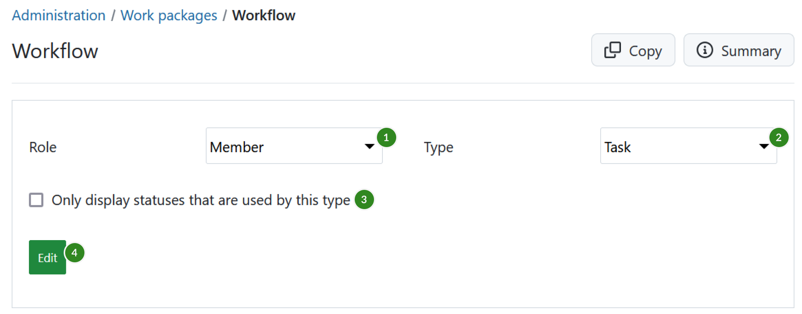

---

sidebar_navigation:
  title: Workflows
  priority: 970
description: Manage Work package workflows.
keywords: work package workflows
---

# Manage work package workflows

A **workflow** in OpenProject is defined as the allowed transitions between status for a role and a type, i.e. which status changes can a certain role implement depending on the work package type.

This means, a certain type of work package, e.g. a Task, can have the following workflows: News -> In Progress -> Closed -> On Hold -> Rejected -> Closed. This workflow can be different depending on the [role in a project](../../users-permissions/roles-permissions).

## Edit workflows

To edit a workflow:

1. Select the **role** from the dropdown menu for which you want to edit the workflow.
2. Select the **work package type** from the dropdown menu for which you want to edit the workflow.
3. Check if you **only want the statuses that are used by this type** to be displayed (this option is selected automatically, but you can always uncheck it). 

**Note**: If you have created a [new status](../work-package-status) and want to add it to a workflow of a certain work package type, you need to deselect this option. Only this way also status that are not (yet) used by this type will appear in the list and can be added to a workflow.

4. Click the **Edit** button.

You will be able to adapt the following:

1. Adapt which **status changes** are allowed by the selected role for the selected work package type. Read the transitions from the Rows (Current status) to the columns (New status allowed), e.g. a status transition from NEW to IN PROGRESS and back would be allowed. Make sure to allow the "way back" in most cases, e.g. back from IN PROGRESS to NEW, to make sure you will be able to correct mistakes.
2. In addition, you can specify if this role is allowed to make specific status changes if the user who has been assigned this role also is the **author of the work package**.
3. Also you can set additional status transitions allowed if the user is the **assignee to a work package**.
4. Don’t forget to save your changes.

## Copy an existing workflow

You can copy an existing workflow by clicking **Copy** in the workflow overview.

You will then be able to determine which existing workflow should be copied to which other workflow.

## View the workflow summary

You can get a summary of the allowed status transitions of a work package type for a role by clicking on **Summary** in the workflow overview.

You will then view a summary of all the workflows. The number of possible status transitions for each type and role are shown in a matrix.

