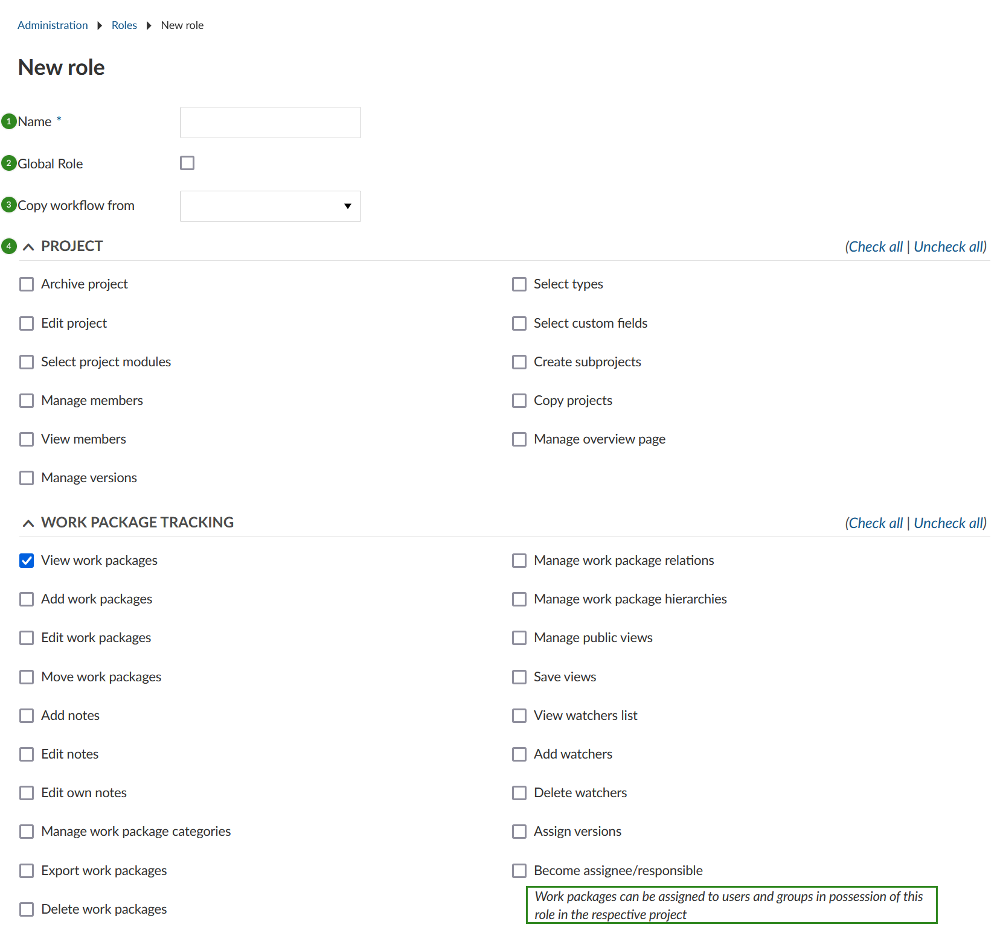
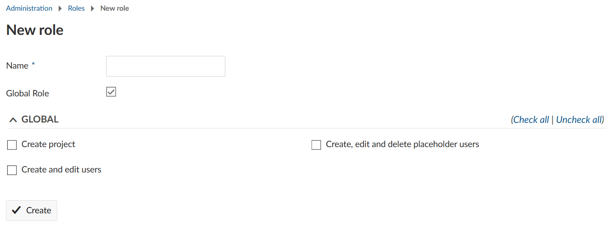
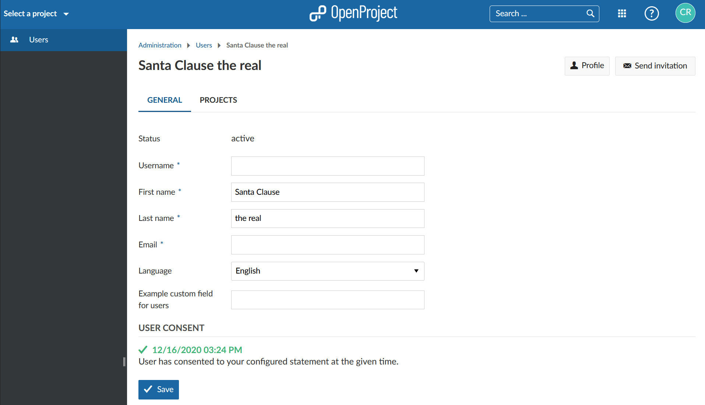

---
sidebar_navigation:
  title: Roles and permissions
  priority: 970
description: Manage roles and permissions in OpenProject.
keywords: manage roles, manage permissions
---
# Roles and permissions

## User

A **user** is any individual who can log into your OpenProject instance.

## Permissions

Permissions control what users can see and do within OpenProject. For example, some permissions dictate whether a user can invite new users to the system, create projects or comment work packages. 

Permission are granted to users by assigning one ore more roles to the users. 

## Roles

A role bundles a collection of permissions. It is an easy, convenient way of granting permissions to multiple users in your organization that need the same permissions or restrictions. 

A user can have one or more roles which grant permissions on different levels: 

| Role type     | Scope of the role                                            | Permission examples                                          | Customization options                                        |
| ------------- | ------------------------------------------------------------ | ------------------------------------------------------------ | ------------------------------------------------------------ |
| Administrator | Application-level: Full control of all aspects of the application | Assign administration privileges to other users Create and restore backups in the web interface Create and configure an OAuth app Configure custom fields Archive projects/restore projects Configure global roles Configure project roles | Can not be changed.                                          |
| Global role   | Application-level: Permissions scoped to specific administrative tasks (not restricted to specific projects) | Manage users  Create projects                      | Administrators can create new global roles and assign global permissions to those roles |
| Project role  | Project-level: Permissions scoped to individual projects (a user can have different roles for individual projects) | Create work packages (in a project) Delete wiki pages (in a specific project) | Create different project roles with individual permission sets |
| Non-member    | Project-level: Permissions scoped to individual projects for users which are logged in | View work packages for users that are logged in              | Assign different permissions                                 |
| Anonymous     | Project-level: Permissions scoped to individual projects for users which are <u>not</u> logged in | View work packages for users that are not logged in          | Assign different permissions                                 |

### Administrator

Administrators have full access to all settings and all projects in an OpenProject environment. The permissions of the Administrator role can not be changed. 

### Global role

Global roles allow Administrators to delegate administrative tasks to individual users:

* Create project
* Create users
* Create, edit, and delete placeholder users
* Create backup
* Edit users

To create a global role check the **Global Role** box when [creating a new role](#create-a-new-role).

### Project role

A **project role** is a set of **permissions** that can be assigned to any project member. Multiple roles can be assigned to the same project member.

> **Note:** If a [project module](../../../user-guide/projects/project-settings/modules/) is not enabled for a specific project it is not shown in that project's menu whether the user has permission for that module or not.

### Non-member

**Non member** is the default role of users of your OpenProject instance who have not been added to a project. This only applies if the project has been set as **[public](../user-guide/projects/#set-a-project-to-public)** in the project settings.

The Non-member role can not be deleted. 

### Anonymous 

OpenProject allows to share project information with users anonymous users which are not logged in. This is helpful to communicate projects goals and activities with a public community.

> **Note**: This only applies if you disabled the need for authentication for your instance and if the project is set as **public**.

The Anonymous role can not be deleted. 

## Customize roles and permissions 

Administrators can customize the roles and the permissions of the different roles in **Administration** -> **Users and permissions** -> **Roles and permissions**.

### Permissions report

The permissions report is a good starting point to get and overview of the current configuration. 

### Create a new role

When creating a role, the **Global role** checkbox can be checked, making it a **Global role** that can be assigned to a [user details](../users/#manage-user-settings) or a [group details](../groups/#add-global-roles-to-a-group) and applied across all projects.

To create a new role, navigate to the administration and select **Users and permissions -> Roles and permissions** from the menu on the left.

You will see the list of all the roles that have been created so far.

After	 clicking the green **+ Role** button, a form will be shown to define the role and its permissions.

Complete the following as required:

1. **Role name** - must be entered and be a new name.
2. **Global Role** - this role applies to all projects, and can be assigned in the [user details](../users/#manage-user-settings) or in the [group details](../groups/#add-global-roles-to-a-group). Once saved, the decision to make a role global can't be reverted.
   Ticking this box will show the available [global roles](#global-roles) and hide the regular permission options.
3. **Copy workflow from** - select an existing role. The respective [workflows](../../manage-work-packages/work-package-workflows) will be copied to the role to be created.
4. **Permissions** for this role - you can specify the permissions per OpenProject module. Click the arrow next to the module name to expand or compress the permissions list.

Select the permissions which should apply for this role. You can use **check all** or **uncheck all** at the right of a module permissions list. If a module is not enabled in a project it is not shown to a user despite having a permission for it.

Don't forget to click the **Save** button at the bottom of the page.

**Note:** In the work package tracking section, you can also give the role permission to be able to be assigned to work packages or to be set as a responsible person.

### Edit and delete roles

To edit a role navigate to the roles overview list and click on the role name. If is not a global role it cannot be converted into one.

To remove an existing role click on the **delete icon** next to a role in the list. It cannot be deleted if it is assigned to a user.

To create a global role check the **Global Role** box when [creating a new role](#create-a-new-role).

You can choose between these global permissions:

- **Create project**: With this permission users can create new projects even when they are not system administrators.
  [Here](../../system-settings/project-system-settings/#settings-for-new-projects) you can set a default role that users with this permission will have in a project they created.
  
- **Create and edit users**: Assign this permission to users who should be able to create or invite new users. They also can edit user profiles in a limited way.
  Users with this permission can add users and edit a user's name, username, email address and language. Additionally, they can can see all users of your OpenProject instance. They can't delete or lock users.
  They can only see the project membership of users for projects in which they have permission to see the members (e.g. as Project admin or Member). They can only manage project membership of users for projects in which they have permission to manage members (e.g. as Project admin).
  The user profile will look like this for them (user name and email address were redacted): 
  
- **Create, edit, and delete placeholder users**: Assign this permission to users (e.g. project admins) who should be able to manage [placeholder users](../placeholder-users).
  Users with this permission can create, edit and delete placeholder users, as well as see all placeholder users in your OpenProject instance.
  **Please note**: They can only see the project membership of placeholder users for projects in which they have permission to see the members (e.g. as Project admin or Member). They can only manage project membership of placeholder users for projects in which they have permission to manage members (e.g. as Project admin).
  A placeholder user's profile will look like this for them: 
  
  