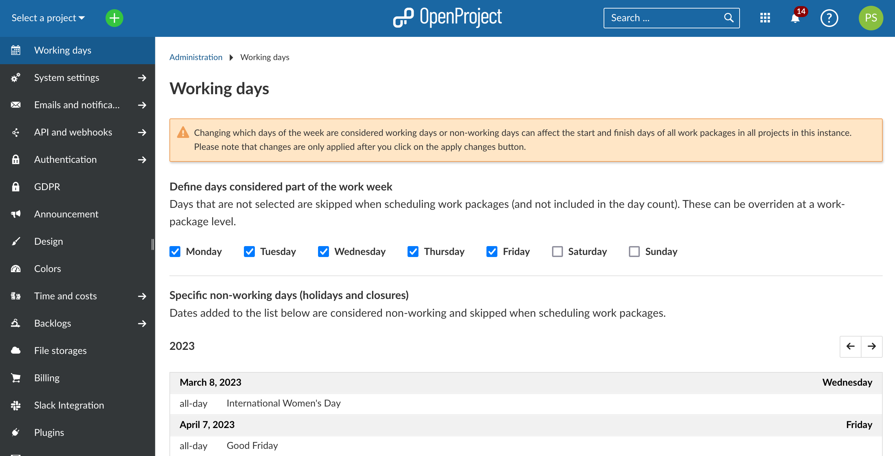

---
sidebar_navigation:
  title: Working days
  priority: 770
description: Define which days of the week are considered working days for scheduling and calculation of duration
keywords: working non-working days work week
---
# Working days

Starting with OpenProject 12.3, administrators are able to define which days of the week are considered working days at an instance level. In other words, this setting defines what OpenProject should consider to be a normal work week when scheduling work packages.

To change this setting, navigate to *Administration* → *Working days*.

> **Note:** By default, the five days from Monday–Friday are considered working days, and Saturday and Sunday are considered non-working.

To change this setting, unselect days that you would like to define as non-working, and select ones that you would like to consider working, and click on **Save**.

### Effect on scheduling

It is important to note that as an instance-level setting, any change here will affect the scheduling of *all work packages* in *all projects* in that instance. It is currently not possible to define working days at a project-level. 

However, it *is* possible to override this setting at the level of individual work packages via the date picker. For more information on how to schedule work packages on non-working days, refer to [Duration and Non-working days in the user guide](../../user-guide/work-packages/set-change-dates/#working-days-and-duration).

> **Important:** Changing this setting will reschedule work packages automatically to the next available working day after clicking on **Save**. For example, removing Friday as a working day by unchecking it will mean that work packages that included Friday will now end one day in the future, and ones that started or ended on Friday will now start and end on Monday. 
>
> Depending on the number of projects and work packages in your instance, this process can take from a couple of minutes to hours. 

Changing this setting is likely to cause changes to scheduling in unexpected ways, and generate a significant number of notifications for assignees, responsibles and watchers for work packages whose dates change as a result. 

We only recommend changing this setting if you are absolutely sure and you are aware of the potential consequences.

### Effect on calendars

The non-working days defined here are coloured differently, generally with a darker background colour, on the [work package date picker](../../user-guide/work-packages/set-change-dates/#working-days-and-duration), [Gantt chart](../../user-guide/gantt-chart/) and the [Team planner](../../user-guide/team-planner/) and [calendar](../../user-guide/calendar/) modules.

