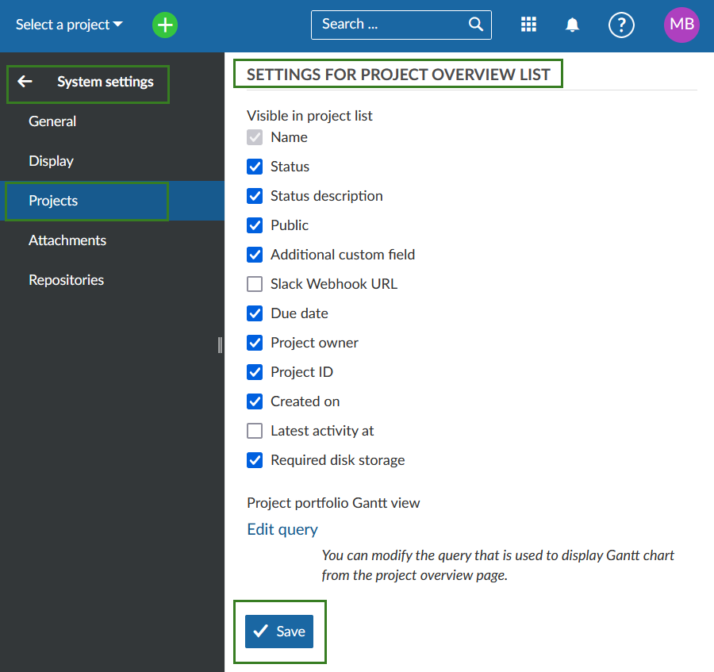

---
sidebar_navigation:
  title: Portfolio Management and Custom Reporting
  priority: 900
description: Step-by-step instruction about portfolio management and custom reporting
keywords: use-case, portfolio management
---

# Use Case: Portfolio Management and Custom Reporting Options

Intro paragraph

Include a screenshot of an end result.

## Creating projects overview

**Step 1:** To view all projects, first select the  **Select a project** dropdown menu, then click on the **Projects list** button. 

**Step 2:** You can sort the list by clicking on a column heading and you can filter the list according to certain information using the filter in the function bar. You can also filter for custom fields, such as *Initiative* or *Start date.* If you have not added any custom fields yet, please see [here](../../system-admin-guide/custom-fields/) how to do it. 

**Step 3:** You can also configure this view using the button with the three dots at the upper right corner and select **Configure**. 

You will then be led to the **System settings** of the global Administration. If you scroll down the page, you can select which columns are to be displayed in the project list in the section **Settings for project overview list** (you will need to scroll down the page). Please save your changes via the blue **Save** button, at the bottom of the page.

Add screenshot for GANTT - Editing Query

## Creating Custom Reports

You can create advanced project reports by using the same techniques and the print function (**CTRL+P**), then saving as PDF, for example. The print function in OpenProject is optimized for reporting purposes. Only information displayed in the main screen area is included. None of the designs or side or top menus are in it.

For more advanced requirements, using the Wiki is another powerful tool. For more information about how to use the Wiki function, please consult [Wiki user guide](../../user-guide/wiki/).

The Wiki function allows you to build complete custom reports using embedded work package tables, macros and even embedded calculations.

Here is an example of how a wiki could look:

And how the dynamic data, such as calculations, filters, macros and reference language work behind the scenes:

For more information about the syntax and how the attributes work please look [here](../../user-guide/wysiwyg/).

If you like to work with multiple Wiki-based reports, you can create an umbrella Wiki page as a table of content, for example, on which all the other reports are listed. See more info on Wiki and the use of Macros [here](../../user-guide/wiki/).
