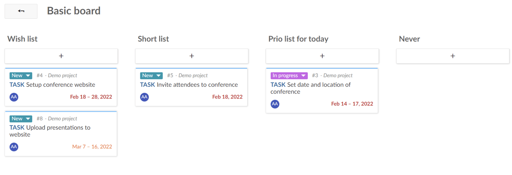
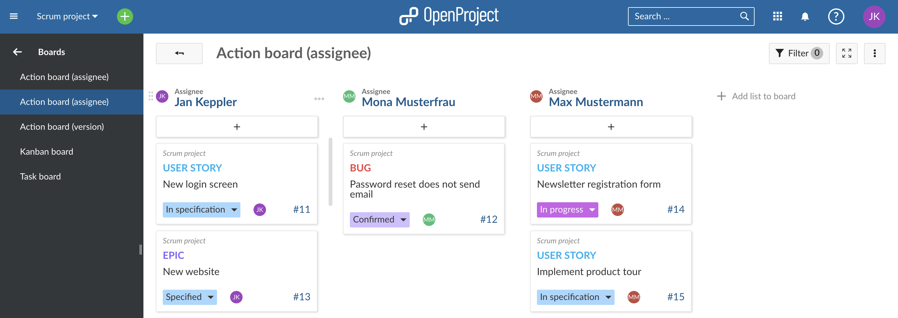
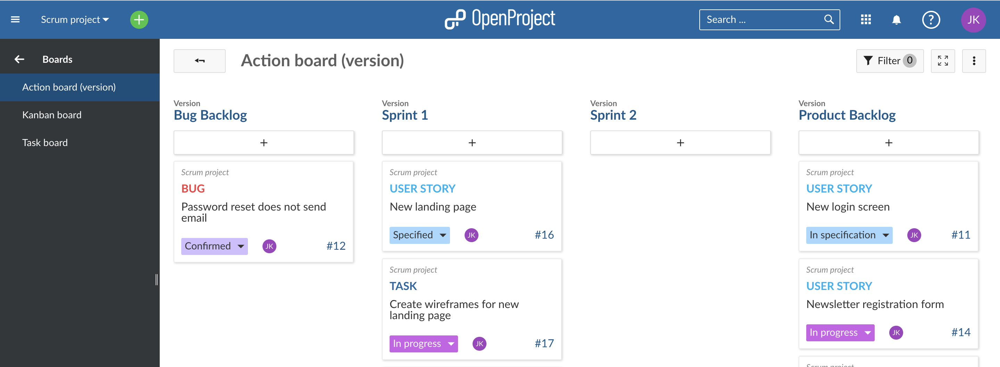
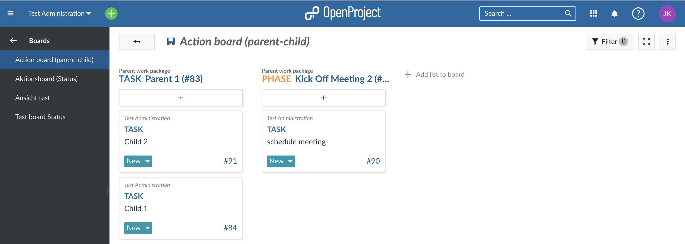
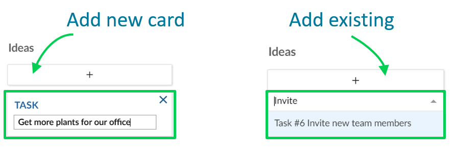
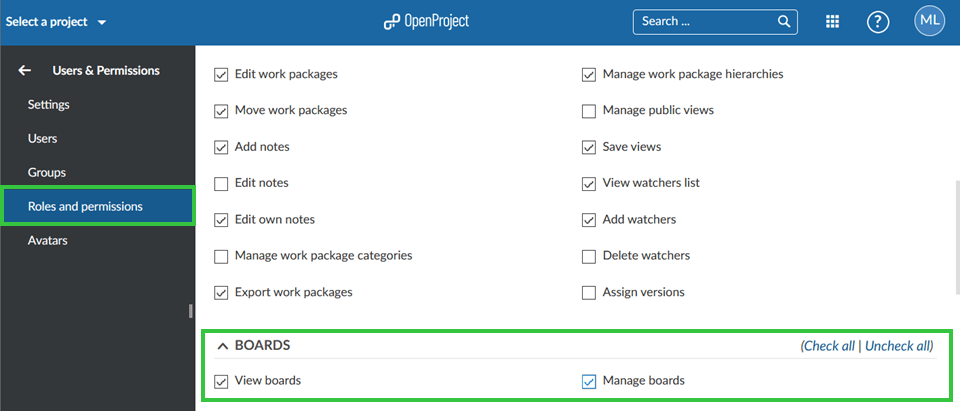
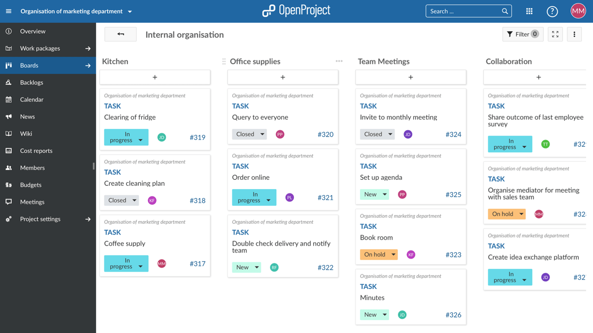
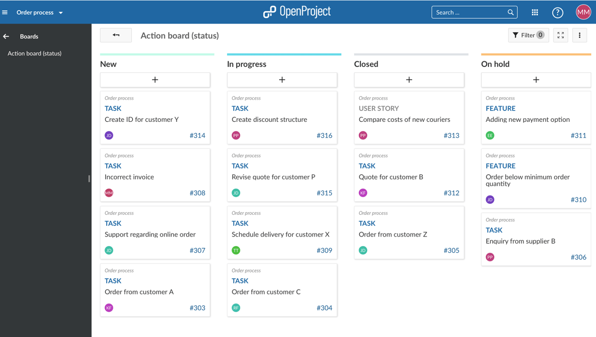
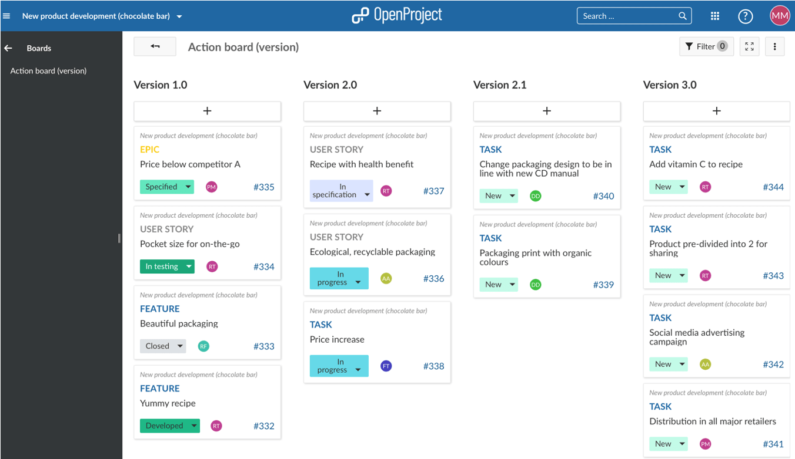

---
sidebar_navigation:
  title: Agile boards
  priority: 860
description: How to get started with Agile boards for Kanban, Scrum and Agile Project Management.
keywords: agile boards, Kanban, Scrum, agile project management, action boards
---

# Boards for Agile Project Management 

Boards support agile project management methodologies, such as Scrum or Kanban.

Our Agile boards can be for anything you would like to keep track of within your projects: Tasks to be done, Bugs to be fixed, Things to be reviewed, Features to be developed, Risks to be monitored, Ideas to be spread, anything! The boards consist of lists (columns) and cards. You can choose between a Basic board and various advanced Action boards.

> **Note**: The basic board is included in the OpenProject Community Edition. OpenProject Action boards is a Premium Feature and can only be used with [Enterprise cloud](../../enterprise-guide/enterprise-cloud-guide/) or [Enterprise on-premises](../../enterprise-guide/enterprise-on-premises-guide/). An upgrade from the free Community Edition is easily possible.

| Topic                                                     | Content                                                      |
| --------------------------------------------------------- | ------------------------------------------------------------ |
| [Create new boards](#create-a-new-board)                  | How to create a new Agile board.                             |
| [Choose between board types](#choose-between-board-types) | What is the difference between the available board types?    |
| [Give the board a title](#give-the-board-a-title)         | How to name a board.                                         |
| [Add lists to your board](#add-lists-to-your-board)       | How to add lists to a board.                                 |
| [Remove lists](#remove-lists)                             | How to remove lists from a board.                            |
| [Add cards to a list](#add-cards-to-a-list)               | How to add cards to a list in a board.                       |
| [Update cards](#update-cards)                             | How to update cards.                                         |
| [Remove cards](#remove-cards)                             | How to remove cards.                                         |
| [Manage boards](#manage-boards)                           | How to manage permissions for boards.                        |
| [Examples for agile boards](#agile-boards-examples)       | Best practices for using the basic board and status, assignee and version board. |

<video src="https://openproject-docs.s3.eu-central-1.amazonaws.com/videos/OpenProject-Agile-Boards.mp4" type="video/mp4" controls="" style="width:100%"></video> 
## Agile boards in OpenProject

The new Boards are tightly integrated with all other project management functionalities in OpenProject, i.e. work packages or Gantt charts. This makes it so easy and practical to include the Boards in your daily project management routines and to gain a much quicker overview of important topics in your project.

## Create a new board

You can create as many Agile boards in a project as you need and configure them to your needs. First, you need to create a new Boards view. 

If you haven't done so yet, [activate the Boards module](../projects/project-settings/modules) within your project. Also, we recommend to verify [Roles and Permissions](../../system-admin-guide/users-permissions/roles-permissions/) within your system's Administration.

Click on the green **+Board** button to create a new Board view. 

## Choose between board types

Next, you need to choose which kind of Agile board you want to create.

### Basic board (Community Edition)
The Basic board is included in the OpenProject Community Edition. You can freely create lists, name them and order your work packages within. If you move work packages between  the lists, there will be **NO changes** to the work package itself. This allows you to create flexible boards for any kind of activity you would like to track, e.g. Management of Ideas. 

### Action boards (Premium feature)

In an Action board each lists represents a value of an attribute of the contained work packages (cards), e.g. there's a list for the status "New" and a list for the status "In Progress" in the Status board.
Moving work packages (cards) between two lists will update them automatically, based on the list to which they're moved.
After [adding lists to your board](#add-lists-to-your-board) they will automatically be filled with the respective work packages.

There are several **types of Action boards** available:

### Status board
Each list represents a status. That means that e.g. all work packages with the status "New" will be automatically displayed in the column "New". 
When creating a new Status board a list with all work packages in the default status (usually this is the status "New") will be added automatically, while additional lists need to be added manually.
Please note: You can't move work packages from or to every status. Please find out more about the work-flow logics restricting this here: [Allowed transitions between status](../../system-admin-guide/manage-work-packages/work-package-workflows/)

### Assignee board
Every list represents one assignee. You can choose regular users, [placeholder users](../../system-admin-guide/users-permissions/placeholder-users) and groups as assignees. When you move a card from one list to another, the assigned user is changed to the user that is selected for the list you moved the card to.

### Version board
Every list represents a version. This board is ideal for product development or planning software releases. When creating a new Version board a list with all work packages in the version(s) belonging to the current project will be added automatically, while additional lists need to be added manually. By moving a card from one list to another, the version for the work package is changed to the version of the corresponding list.

### Subproject board
Every list represents a subproject. Within the list you will find the subproject's work packages. By moving a card within a list you can change the order of the cards and if you move a card to another list you change the (sub)project of this work package.

### Parent-Child board
Every list represents a parent work package. Within the list you will find the work package's children. 
Only work packages from the current project can be selected as a list, i.e. can be chosen as the name of the list.
The Parent-Child board is ideal for depicting a **work breakdown structure (WBS)**. By moving cards to another list you can reorder the work package as a child to another work package.
Please note: This will only display one hierarchy level below the displayed work package, i.e. only immediate children and no grandchildren.

## Give the board a title

Choose a meaningful title for your Board so that it is clear, e.g. for other team members, what you want to do.

 

## Add lists to your board

**Lists** usually represent a **status workflow**, **assignees**, a **version** or **anything** that you would like to track within your project. You can add as many lists that you need to a Board.

**Action boards lists**: The available lists depend on the [type of board you choose](#choose-between-board-types). Remember: if you change a card between the lists, the respective attribute (e.g. status) will be updated automatically.
**Basic board lists**: You can create any kind of list and name them to your needs. Remember: No updates to the attributes will happen when moving cards between the lists.

  

Click **+ add list** to add lists to your board.

 

**Basic board lists:** Give the list any meaningful name.
**Action board lists:** The list's name will depend on the type of Action board you chose, e.g. "New", "In Progress", etc. for the Status board.

 

## Remove lists

To remove lists, click on the three dots next to a list's title, and select **Delete list**. 

## Add cards to a list

You can add cards to a list. Cards represent a [work package](../../user-guide/work-packages/) in OpenProject. They can be any kind of work within a project, e.g. a Task, a Bug, a Feature, a Risk, anything.

 

Click **+** under the lists' title to add a card: create a new card or choose an existing work package and add it as a card to your list.

 

**Add new card**: enter a title and press Enter.
**Add existing**: enter an existing title or an ID and press Enter.

## Update cards

You can update cards in the following ways:

**Move cards with drag and drop** within a list or to a new list. Remember: Moving cards to another list in an Action board will update their attributes, e.g. status.

 

Apart from the Status board you can **update a work package's status** directly in the card.

 

A **double click on a card** will open the work package's **fullscreen view.** The **arrow** on top will bring you back to the boards view. 

Clicking on **Open details view** (the blue "**i**") will open the work package's **[split screen view](../work-packages/work-package-views/#work-package-split-screen-view)**. You can close it by clicking on the **"x"** in its upper right corner.

## Remove cards

To remove a card from a **Basic board** hover over the card and press the **X**.

 

Cards from **Actions boards** will be removed automatically from a list as soon as the respective attribute (e.g. Status) is changed.

Removing a card will not delete the work package, you can still add it back to the list or access it via the work packages module.

## Manage boards

To **create new** boards, **open existing** boards, or **delete** boards, navigate to the main Boards menu item.

 

Verify and **update roles and permissions for boards** in the [system's administration](../../system-admin-guide/users-permissions/) if necessary.

 

## Agile boards examples

We would like to show you some examples so that you get an idea on how to use Agile boards. 
Also, once you have set up your custom boards, you can easily copy them along with your (whole) project to use them as a basis for new ones. Please note: The subprojects in the Subproject board won't be copied.

### Basic board

Freely create any kind of list you need to organize your team in OpenProject. If it is organizing tasks for a department, planning a team event, collecting feedback for different topics, coordinating tasks in different locations, generating ideas and many more. Every team member can add tasks to this board and thus the board will be growing over time. It allows you to always know what tasks need to be done without using an Excel file and one coordinator. Everyone has access to the information at any time from anywhere.

### Action boards

**Status board**

The Status Action board is probably the most used Agile board. Start with the three basic status “new”, “in progress” and “closed” and see what status you might need according to your way of working. With a status action board, you can implement the KANBAN principle, continuously improving the flow of work.
If you would for example like to map your order process in a board, you can use the status board to pass the tickets through the status. From an incoming order (new), to when it is being handled (in progress) to when it is done (closed). Accompanying work packages to the actual order process would also be shown in this board to give a good overview, e.g. adding a new payment option. Different people from different departments can work together and are up to date on where every work package stands without having to ask.

**Assignee board**

Know who is working on what. If a cross-functional team is e.g. developing a product together, you would like to know who is working on what and if everything is on track. The assignee board gives you the opportunity to get an overview of responsibilities, how busy the teams are and if all tasks are distributed. It gives the teams clear responsibilities. The marketing team knows that the finance team is doing the product calculation but they have to check the overall product profitability themselves.
Of course you don’t need to use groups as assignees, you can also use individual team members in the list.

**Version board**

The Version board facilitates the planning of a product development in several iterations. With every iteration you can add and improve features and let your product become the best version for your customers. If a certain feature is e.g. too complex to be developed in one specific version because you have other features to develop with higher priority, just drag it to the next version and it will update automatically. This board gives you a perfect overview of what is coming and you can see at a glance if it fits your priorities. If not, adjust with drag and drop.

