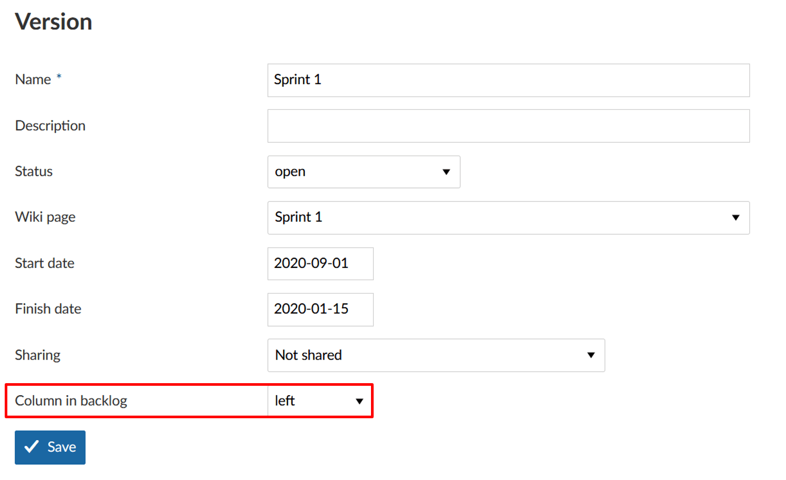

---
sidebar_navigation:
  title: Manage sprints
  priority: 900
description: Create a new sprint in the backlogs view.
keywords: manage sprints
---

# Create a new sprint

In order to work with the Backlogs module, at least one sprint needs to be created in the project settings.

Sprints are technically a version in OpenProject. Therefore, creating a sprint is done following the same procedure as for creating a new version.

It is advisable to number your sprints chronologically for a better overview.  Sprints usually run for a fixed period of approx. two to three weeks. In order to configure these settings, click on the Sprint title in the  backlogs view.

For some settings, such as start and end date, you can  also use in-line editing.

Click on the green **+ Version** button to add a new sprint. Click on the arrow next to a sprint and select -> *Properties* to edit a sprint.

On the new page, you can specify details of the version such as description, status, (sprint) wiki page, start and end date, as well as  sharing options across projects. Moreover, you can create a custom field and decide where the version is to be displayed in the backlog. 

The Column in backlog settings define whether the version should be displayed in the backlogs view on the left side (recommended for sprints) or on the right side (recommended for product backlog, bug backlog, wishlist, etc.)

> **Note**: Sprints (versions displayed on the left side of the backlogs page) offer more options – such as opening the task board and displaying the burndown chart.

 