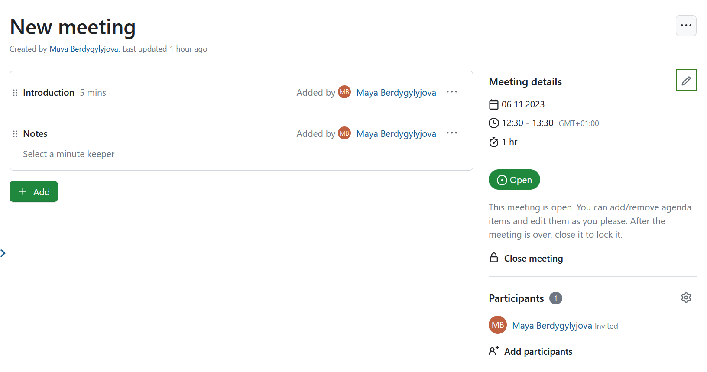
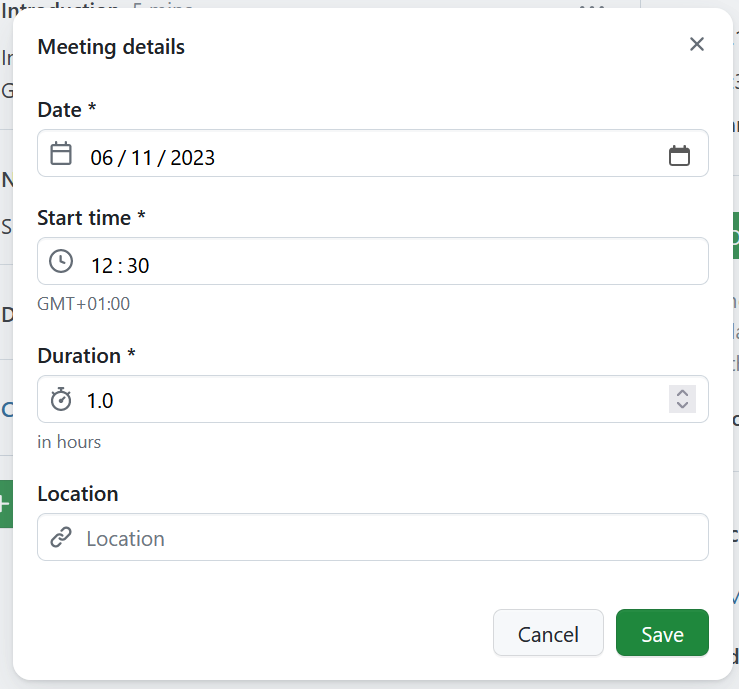
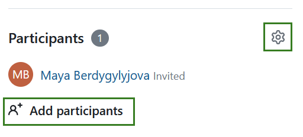
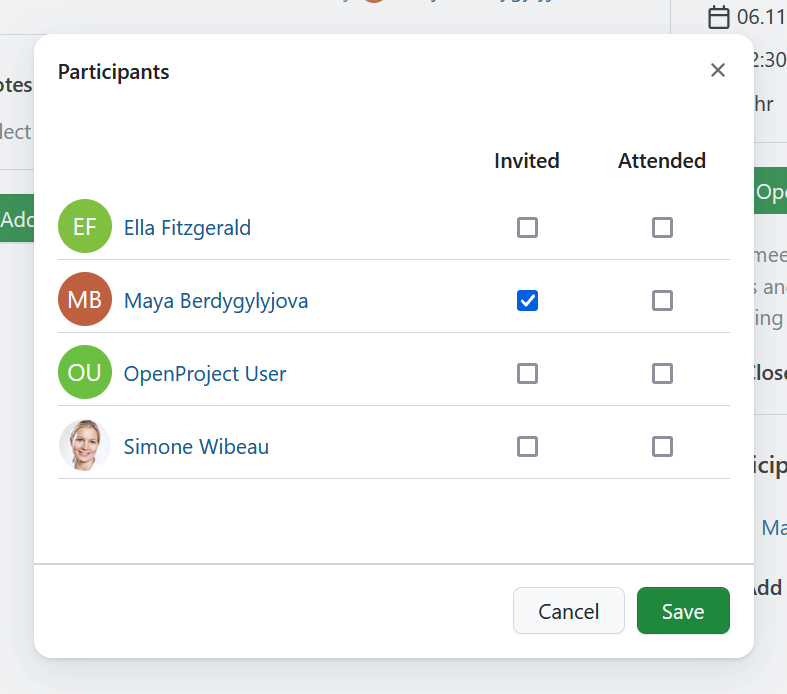

---
sidebar_navigation:
  title: Dynamic meetings
  priority: 759
description: Manage meetings with agenda and meeting minutes in OpenProject.
keywords: meetings, agenda, minutes
---

# Meeting management

Meetings in OpenProject allow you to manage and document your project meetings at one central place, prepare a meeting agenda together with your team and document and share meeting minutes with your meeting attendees at one central place.

**Meetings** is defined as a module that allows the organization of meetings. 

**Note:** in order to be able to use the meetings plugin, the **Meetings module needs to be activated** in the [Project Settings](../projects/project-settings/modules/). 

| Topic                                                                     | Content                                     |
|---------------------------------------------------------------------------|---------------------------------------------|
| [Meetings in OpenProject](#meetings-in-openproject)                       | How to open meetings in OpenProject.        |
| [Create a new meeting](#create-a-new-meeting)                             | How to create a new meeting in OpenProject. |
| [Edit a meeting](#edit-a-meeting)                                         | How to edit an existing meeting.            |
| [Add meeting participants](#add-meeting-participants)                     | How to invite people to a meeting.          |
| [Create or edit the meeting agenda](#create-or-edit-the-meeting-agenda)   | How to create or edit the agenda.           |
| [Copy a meeting (recurring meetings)](#copy-a-meeting-recurring-meetings) | How to create recurring meetings.           |

## Meetings in OpenProject

By selecting **Meetings** in the project menu on the left, you get an overview of all the meetings within a specific project sorted by date. By clicking on a meeting name you can view further details of the meeting.

To get an overview of the meetings across multiple projects you can select **Meetings** in the [global modules menu](https://www.openproject.org/docs/user-guide/home/global-modules/).

The menu on the left will allow you to filter for upcoming or past meetings. You can also filter the list of the meetings based on your involvement. 

## Create a new meeting

You can either create a meeting from within a project, or from the **Meetings** global module. 

To create a new meeting, click the green **+ Meeting** button in the upper right corner.

Enter your meeting's title, location and start date and duration.

Select the meeting participants from the project members list.

If you are creating a meeting from a global module you will need to select a project to which the meeting is attributed.

Click the blue **Create** button to save your changes.

IMAGE WHEN FINAL

## Edit a meeting

If you want to change the details of a meeting, for example its time or location, open the meetings details view by clicking on pencil icon next to the **Meeting details**. 

An edit screen will be displayed and the following meeting information can be adjusted: date, time, duration and location of a meeting.

Do not forget to save the changes by clicking the green **Save** button. Cancel will bring you back to the details view.

In order to edit the title of the meeting select the dropdown menu behind the three dots and select the **Edit meeting title**.

 

## Download a meeting as an iCalendar event

You can download a meeting as an iCalendar event. To do that select the dropdown, same as you would when editing the meeting title and select the **Download iCalendar event**.

 

## Add meeting participants

You will see the list of all the invited project members under **Participants**. You can **add participants** (Invitees and Attendees) to a meeting while being in the [edit mode](#edit-a-meeting). The process is the same whether you are creating a new meeting or editing an existing one. 

You will see the list of all the project members and the based on the check marks next to the name you will be able to tell which project members have been invited. After the meeting you can record who actually took part in it.

By removing the check mark you can remove project members from the meetings.

Click on the **Save** button to secure the changes made by you.

## Send email to all participants

You can send an email to all the meeting participants. To do that select the dropdown, same as you would when editing the meeting title and select **Send email to all participants**.

## Create or edit the meeting agenda

After creating a meeting, you can set up a **meeting agenda**.

You can add items to an agenda or directly link work packages by selecting the respective option under the green **Add** button.

## Close a meeting

Once the meeting is closed you can click the **Close meeting**, after this it will no longer be possible to edit the meeting agenda.

## Delete a meeting

You can delete a meeting. To do that select the dropdown, same as you would when editing the meeting title and select the **Delete meeting**. You will need to confirm that decision.
