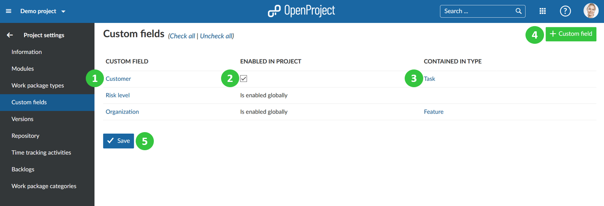

---
sidebar_navigation:
  title: Enable work package custom fields
  priority: 700
description: Manage custom fields in a project.
keywords: custom fields, activate work package custom field
---
# Enable custom fields in projects

**Custom fields for work packages can be activated or deactivated in a project**. 

**Custom fields** are defined as additional attribute fields which can be added to existing attribute fields. The different sections that can use custom fields are work packages, spent time, projects, versions, users, groups, activities (time tracking), and work package priorities.

**Please note:** The instructions in this section *only* apply to custom fields for work packages.

Before you can enable a custom field it needs to be created in the [system administration](../../../../system-admin-guide/custom-fields). Afterwards, open the respective project and go to -> *Project settings* -> *Custom fields*.

1. Manage the custom field by clicking on the name.
2. **Select if the custom fields shall be enabled in the project**. If enabled globally in the custom fields settings in the system administration, it will automatically be displayed in all projects.
3. View the work package types for which the custom field is already enabled. Only for the displayed types the custom field will be active. You can add the custom field to additional work package types by [adding them to the respective work package form](../../../../system-admin-guide/manage-work-packages/work-package-types/#work-package-form-configuration-premium-feature).
4. **Create a new custom field** with the green + Custom field button. You have to be a system administrator in order to create new custom fields.
5. Press the blue **Save** button to confirm your changes.

