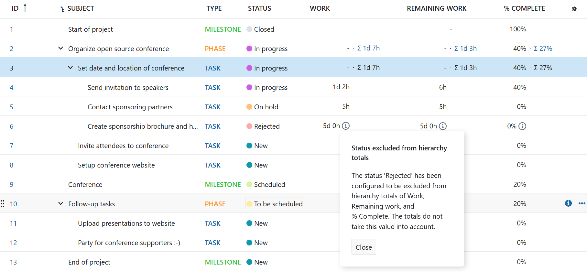
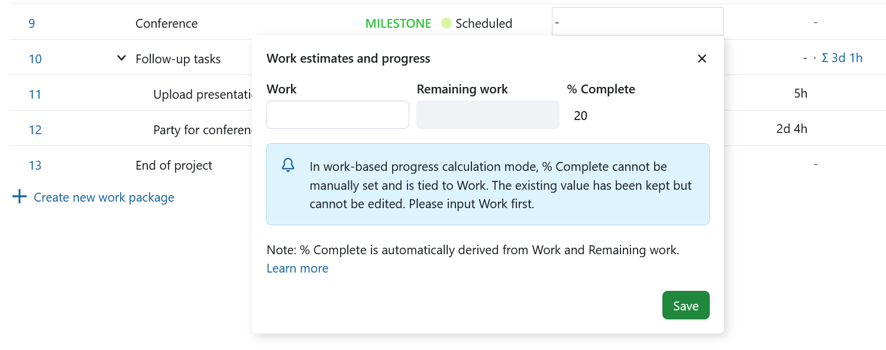

---
sidebar_navigation:
  title: Progress tracking
  priority: 800
description: How to use OpenProject to track and report progress of work packages in either work-based or status-based reporting modes.
keywords: Progress tracking, estimated time, remaining time, work, % complete, percentage complete, remaining work
---

# Progress tracking

OpenProject lets you track and monitor the progress of your work packages.

> **Note:** Since OpenProject 14.0, the way progress is reported and calculated has changed significantly. Please read the documentation below to understand how OpenProject handles work and progress estimates.

## Terms

[OpenProject 13.2](../../../release-notes/13-2-0/) introduced important changes in the names of three work package fields:

| **Old term**     | **New term**          |
|--------------------|------------------------|
| Progress         | %&nbsp;Complete       |
| Estimated time   | Work                  |
| Remaining time   | Remaining work        |

>**Note**: You will still find the new attributes if you search using their older names (in the list of filters, for example).

## Units of measurement

[OpenProject 14.2](../../../release-notes/14-2-0/) transformed the measurement units of Work and Remaining Work from hours to **days and hours**. This allows you to input values for Work and Remaining work in different units. See the examples below:

- Valid inputs for 2 hours and 30 minutes:

  - "2.5"
  - "2.5h"
  - "2h 30m"
  - "2 hours 30 minutes"

- Valid inputs for 6 days:

  - "48"
  - "48 hour"
  - "6d 0h"
  - "6 days"

The default setting is set to be 8 hours per day. Your administrator can change [how many hours are considered a day](../../../system-admin-guide/calendars-and-dates/#working-days-and-hours).

## Progress reporting modes

OpenProject offers two modes for reporting progress:

- **Work-based progress reporting** enables you to automatically derive progress based on the values you enter for Work and Remaining work
- **Status-based progress reporting** allows you to assign fixed % Complete values to statuses, and automatically derive Remaining work based on the values for Work you can enter

>**Note:** The administrator of your instance will have selected a mode for the entire instance. If you are an administrator, you can modify this by following our [admin guide on work package settings](../../../system-admin-guide/manage-work-packages/work-package-settings).

### Work-based progress reporting

%&nbsp;Complete is an automatically calculated value that is a function of Work and Remaining work, unless %&nbsp;Complete is configured to be [set by status](#status-based-progress-reporting).

>**%&nbsp;Complete** is work done (**Work** - **Remaining work**) divided by **Work**, expressed as a percentage. For example, if Work is set at 50h and Remaining work is 30h, this means that %&nbsp;Complete is _(50h-30h)/50h))_ = **40%**. Please note that these calculations are independent and unrelated to the value of **Spent time** (which is based on actual time logged).

This means that for a work package to have a value for %&nbsp;Complete, both Work and Remaining work are required to be set. To make this link clear and transparent, clicking on *Work* or *Remaining work* to modify them will display the following pop-over:

This allows you to edit Work or Remaining work and get a preview of the updated %&nbsp;Complete value before saving changes. Changing any one field will automatically update the other two.

>**Note:** If you enter a value for Remaining work that is higher than Work, you will see an error message telling you that this is not possible. You will have to enter a value lower than Work to be able to save the new value.
>
>Additionally, the value for Remaining work cannot be removed if a value for Work exists. If you wish to unset Remaining work, you need to also unset Work.

### Status-based progress reporting

Administrators can also switch to [status-based progress reporting mode](../../../system-admin-guide/manage-work-packages/work-package-settings/) for their instance.

In this mode, each status is associated with a fixed %&nbsp;Complete value in the [admin settings for each one](../../../system-admin-guide/manage-work-packages/work-package-status/), which can be freely updated by changing the status of a work package. This allows teams to report progress simply by changing the status of their work packages over time.

> For example, "New" could be set to 0%, "In progress" to 30%, "In test" to 60% and "Implemented" to 100%. Then, as project members update the status, the %&nbsp;Complete values would reflect these changes automatically.

Unlike in work-based progress reporting mode, in status-based mode, Remaining work is an automatically calculated value that cannot be manually edited.

>**Remaining work** is **Work** times **(100% - %&nbsp;Complete)**, expressed in hours. For example, if the %&nbsp;Complete for a selected status is 50% and Work is 10h, Remaining work is automatically set to 5h.

In Status-based progress reporting mode, Work is not a required value. However, if Work is set, Remaining work is automatically calculated. To make this link clear and transparent, clicking on the value for Work will display the following pop-over:

This allows you to edit %&nbsp;Complete (by changing status) or Work and get a preview of the updated Remaining work before saving changes.

>**Note:** In the upcoming version, statuses cannot have an empty %&nbsp;Complete value in status-based progress reporting mode.When upgrading, all statuses that do not have a value will take the default value of 0%.

## Hierarchy totals

OpenProject will automatically show totals for Work, Remaining work and % Complete in a work package hierarchy (any parent with children). These appear in a work package table as a number with a Σ sign next to it, indicating that it is a total of the values of the parent _and_ children.

> **Note**: The total %&nbsp;Complete value of a hierarchy is a weighted average tied to Work. For example, a feature with Work set to 50h that is 30% done will influence the total of %&nbsp;Complete of the parent more than a feature with Work set to 5h that is 70% done.

### Excluding certain work packages from totals

In some cases, you might want to exclude certain work packages (like those with status *rejected*) from total calculations of the parent. Administrators can define these exclusions by going to the [Administration settings for any status](../../../system-admin-guide/manage-work-packages/work-package-settings/) and check a new option called "Exclude from calculation of totals in hierarchy". All work packages with this status will then be excluded when calculating the total value for the parent (for all fields: Work, Remaining work and %&nbsp;Complete).

A small info icon will appear next to excluded values to remind you of this fact:

## Changing modes

When an administrator changes the progress calculation mode from Work-based to Status-based, the % Complete values might be in a transitional stage.

## Work- to status-based

When switching from Work-based to Status-based mode, the previous value for %&nbsp;Complete will be replaced by the the %&nbsp;Complete value associated with the current status of that work package. Then there are two cases to consider:

- If Work was previously set, it will be retained and Remaining work will be re-calculated based on the other two values
- If Work was previously empty, then Work and Remaining work will remain empty

## Status- to work-based

In Status-based mode, it is possible for work packages to have a %&nbsp;Complete value (defined by the status) without having values for Work or Remaining work. In other words, the Work and Remaining work can be empty.

When switching to Work-based mode, OpenProject will retain the value for %&nbsp;Complete that was set with status. It can then be modified by putting in Work and Remaining work, thereby overwriting the previous value with a new computed value:

