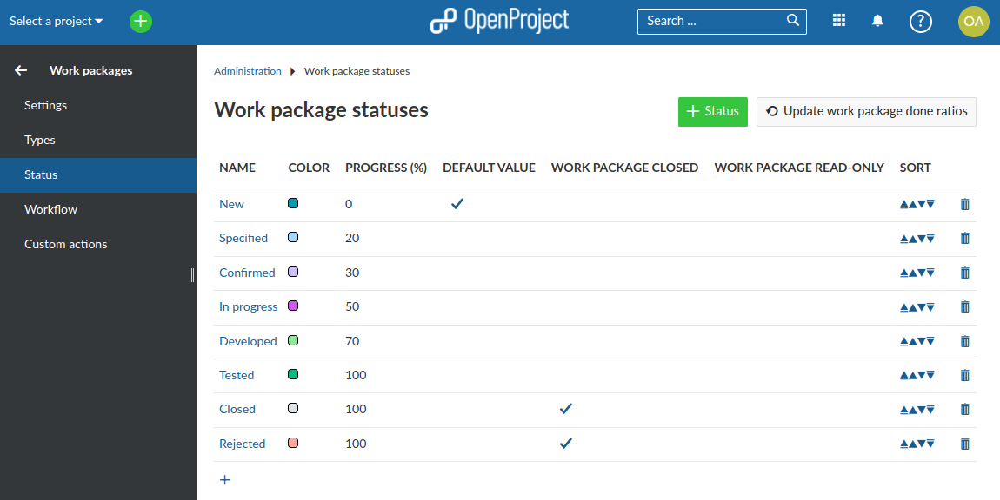

---
sidebar_navigation:
  title: Progress tracking
  priority: 800
description: Progress tracking in OpenProject.
keywords: Progress tracking, cost reporting, earned value analysis, earned value management
---

# Progress tracking

You can track the completion of projects in OpenProject by assigning 
a **Progress (%)** value to individual work packages. 
OpenProject will automatically roll-up progress to parent work packages.

| Topic                                                                                               | Content                                           |
|-----------------------------------------------------------------------------------------------------|:--------------------------------------------------|
| [Manual progress tracking](#manual-progress-tracking)                                               | How to track progress manually per work package?  |
| [Progress tracking in the work package hierarchy](#progress-tracking-in-the-work-package-hierarchy) | How to track progress for multiple work packages? |
| [Status based progress tracking](#status-based-progress-tracking)                                   | How to track progress use work package status?    |

## Manual progress tracking

After the initial installation, OpenProject is configured
for manual progress tracking. In order to log progress,
please open the details of a work package.
The **Progress (%)** field shows a visual progress bar with
the default value of 0%.

Clicking on the progress bar opens an in-place editor 
that allows you to enter a percentage value between 0 and 100.

Pressing enter saves the value and updates dependent work packages (see below). 
Progress is rounded to the next integer.

You can also bulk-modify the **Progress (%)** in the list of work packages.

## Progress tracking in the work package hierarchy

The progress of **work package with children** is calculated as the 
weighted average of all direct children, using the field **Estimated time** 
as the weight. 
When adding the **Progress(%)** column to a work 
package hierarchy view, please also add the **Estimated time** 
column as well so that you can track the calculation.
The screenshot below shows an example hierarchy with aggregated 
**Progress (%)**.

Please note the **Estimated time** column to the right. 
Here, values in parenthesis (for example “(40h)” of Main Task) 
indicate estimated time from children, while values without 
parenthesis refer to estimated time directly assigned to a work 
package. 

Calculation examples:
 * Sub-Task 1 has 50% completion calculated as (16h * 60% + 8h * 30%) / 24h.
 * Sub-Task 2 has 25% completion calculated as (8h * 50% + 8h * 0%) / 16h.
 * Main Task has 40% completion calculated as (24h * 50% + 16h * 25%) / 40h.

## Status-based progress tracking

As an alternative to the manual progress tracking mode above, you can configure 
your OpenProject system to associate work packages statuses .
In the administration section please modify the 
[work package settings](../../../system-admin-guide/manage-work-packages/work-package-settings) and set the value of “Calculate the work package done ratio” to 
“Use the work package status”.

In this mode, OpenProject does _not_ allow you to modify the 
**Progress (%)** field.
Instead, the **Progress (%)** value will be taken from the work package 
status configuration page:

The screenshot above shows a sample configuration of work package 
statuses together with suitable “Progress (%)” values. 
For example, setting the status of a work package to “In progress” 
is equivalent to setting **Progress (%)** to 50% manually.

Note: The status and it’s associated progress value from the 
administration screen also determines the **Progress (%)** of 
work packages with children. So there is no roll-up of progress 
in the work package table hierarchy in this configuration.
