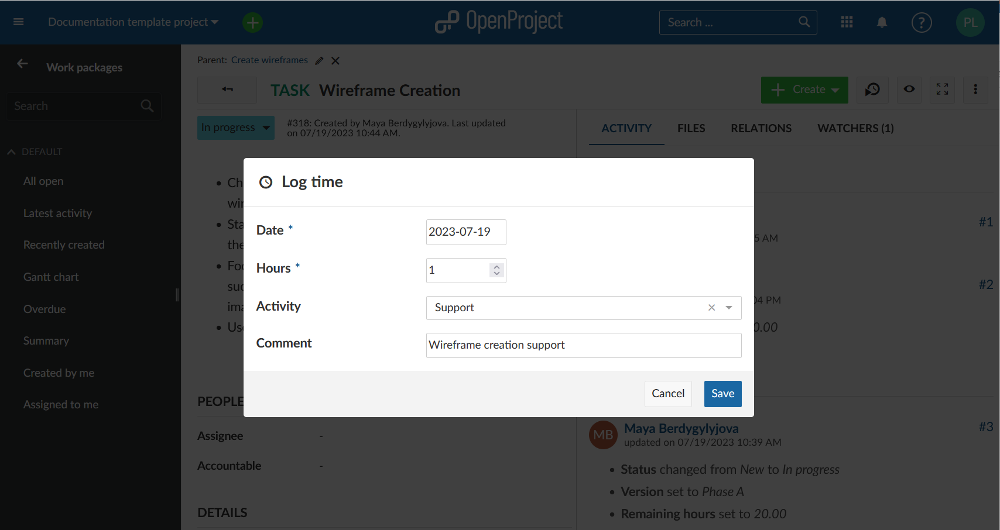
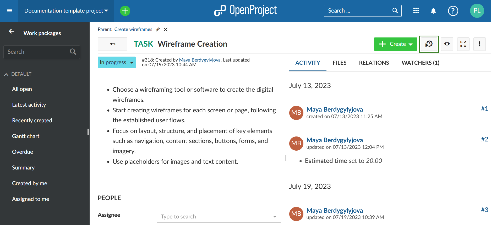
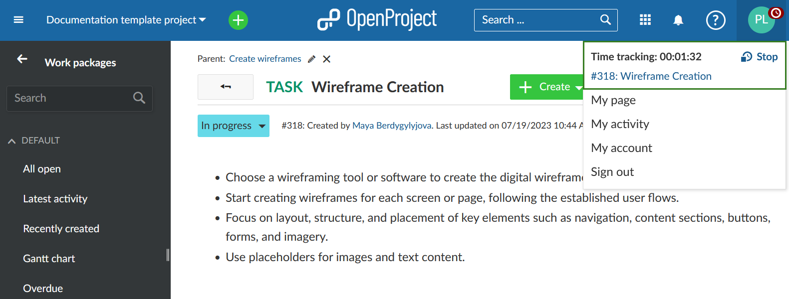
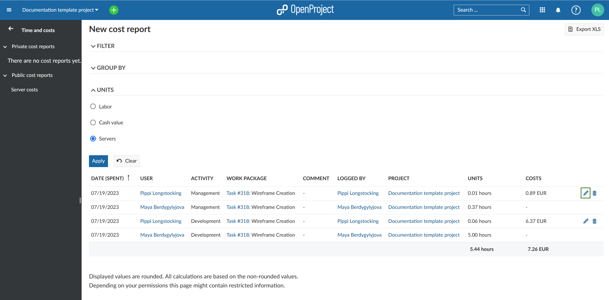
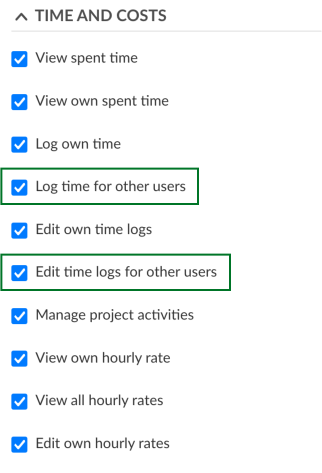
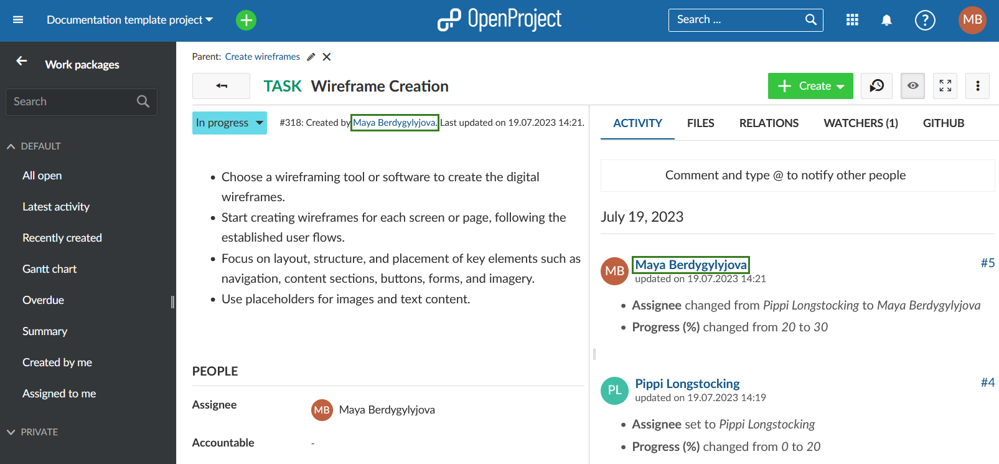

---
sidebar_navigation:
  title: Time tracking
  priority: 799
description: Time tracking in OpenProject
keywords: time tracking, logging time, define rate, labor costs
---

# Time tracking

Users can book their time or units spent on an activity within a project directly on work packages,  which gives a clear indication of how much effort the project activities require. You can log time in the work package view, track time via the time tracking button or via a commit message. You can also log time directly from **My spent time** widget on **My Page**.

> **Note**: To use the time tracking functionality, the **Time and costs module** needs to be activated in the [project settings](../../projects/project-settings/modules/).

| Topic                                                                           | Content                                                                            |
|---------------------------------------------------------------------------------|------------------------------------------------------------------------------------|
| [Log time in the work package view](#log-time-in-the-work-package-view)         | How to log time to a work package.                                                 |
| [Log time via the time tracking button](#log-time-via-the-time-tracking-button) | How to track time in real time using the start/stop time tracking button           |
| [Log time via commit message](#log-time-via-commit-message)                     | How to log time via a commit message to a work package.                            |
| [Log time via My page](#log-time-via-my-page)                                   | How to easily track and display spent time in the spent time widget on the MyPage. |
| [Edit logged time](#edit-logged-time)                                           | How to edit logged time on a work package.                                         |
| [Delete time entries](#delete-time-entries)                                     | How to delete time entries logged to a work package.                               |
| [Logging and editing time for other users](#log-and-edit-time-for-other-users)  | How to log time to work packages.                                                  |
| [Define hourly rate for labor costs](#define-hourly-rate-for-labor-costs)       | How to easily track labor costs per user.                                          |
| [Toggl integration](./toggl-integration)                                        | How to track spent time with Toggl.                                                |
| [TimeCamp integration](./timecamp-integration)                                  | How to track spent time using TimeCamp.                                            |
| [Time Tracker integration](./time-tracker-integration)                          | How to record and log spent time using Time Tracker.                               |

## Log time in the work package view

In order to log spent hours for a certain activity, open the details of the corresponding work package. Select **Log time** from the **More functions** drop down menu, the icon with the three dots in the top right of the work packages details. Or use the **Log time** icon next to **Spent time**. 

Alternatively, you can also log time via the work package table. To do this, simply click with the right mouse pointer on the line of the work package, which you want to track times for and then select "log time" from the entries in the list. You will then also be led to the form for logging time.

You will be directed to the detailed view to log time where you can edit the following:

- The date, for which the time will be logged.
- The actually logged time (in hours).
- The **Activity** drop down menu offers a choice of activity  categories, such as coordination or development. The range of categories can vary from project to project and can be edited by a project  administrator or a role with respective permissions.
- The comment field, where you can note a more detailed description of the activities that you log time for.
- Don’t forget to **Save** your logged time.

The aggregated time spent on a work package is shown in the work package details view.

## Log time via the time tracking button

Starting with OpenProject 13.0, you can also track time in real time using the start/stop time tracking button. To do this, navigate to a work package you are working on and click on the **Start time tracking button**. 

This will start the time tracking timer for the current work package. A timer icon will also appear next to your avatar in the top right corner as a reminder in case you navigate away from the work package.

Once you are done working, you can stop tracking time by clicking the **Stop time tracking button**. This will open a pop up window with the recorded time spent based on the timer. You may correct or adjust this time manually if you wish.

If you want to continue tracking time, click **Cancel** and the timer will continue running. If you do not want to log time, click **Delete**. Clicking **Save** will log the time the same as if you had manually logged it. 

If you navigate away from the work package in which you have a timer running, you can easily navigate back to it or stop the timer via the time tracking controls visible when you click on your avatar from anywhere in OpenProject.

## Log time via commit message

> **Note**: this is a power user feature that is currently only available for on-premises installations. 
>
> **Enable time logging** option must be [activated under system settings](../../../system-admin-guide/system-settings/repositories/) in order to log time via a commit message. 

To log time via commit message **Repository** module must be activated and an SVN or Git repository needs to be configured. Once it is configured you can enter the following syntax into a commit message of your client (for example GitHub desktop client or a command line client) to log time: *refs #work package number @amount of hours*. For  example refs #123 @2h will log 2 hours of spent timefor the work package number 123.

## Log time via My Page

You can easily track spent time in the **spent time widget on the MyPage** and get an overview about all your activities during a week. It is like a weekly timesheet for yourself.

See more information about the My spent time widget on the [MyPage](../../../getting-started/my-page/#my-spent-time-widget).

## Edit logged time

To edit logged time, click in the amount of the **Spent time** in the work packages details view.

This will bring you to the time tracking report where you will see all time entries to this work package. Depending on your rights you may not be able to edit time entries made by other users.

Click on the **Edit** icon next to your time entry in the list.

The same detailed view to log your time entries will appear where you are now able to apply your changes.

## Delete time entries

To delete a time entry, also click on the **Spent time** in the details of a work package (same as when editing a time entry).

In the list of time entries, click on the **Delete** icon next to a time entry to drop the logged time. Depending on your role in a project you may or may not be able to delete time entries of other project members.

## Log and edit time for other users

Starting with OpenProject 12.2, users with certain roles are able to log and edit time for other users. 

> To enable this functionality, an administrator has to grant this privilege to a particular role in the **Roles and Permissions** section under **Users and Permissions** in the administrator settings.
>
> There are two permissions that can be enabled.
>
> - *Log time for other users* allows users with that role to log time on behalf of other users
> - *Edit time logs* for other users allows users with that role to modify and adjust time logged for other users

Once the permissions have been granted, you will notice subtle differences in the interface.

The **Log time** modal now has a new field called "User", that allows you to select a user other than yourself:

When accessing cost reports, you will see a new column titled "Logged by". The author of the logged time can be different from the user for whom the time is logged:

A user with permissions to edit time logged by other users can edit each entry as they would their own. The "Logged by" field will always display the name of the user who made the last edit.

## Track labor costs

In order to track labor costs, you need to [define an hourly rate](#define-hourly-rate-for-labor-costs) in your user profile first. The labor costs will then be calculated automatically  based on your hours booked and your hourly rate.

## Define hourly rate for labor costs

You can define an hourly rate to track labor costs per user. You will need system admin permissions for this. Please navigate to the user profile, e.g. by clicking on a hyper link of the user name on a work package.

You will be directed to the user's profile page.

Here, you can click the **Edit button** on the top right corner of the user profile page.

Alternatively, you can navigate to *Administration -> Users and permissions -> Users* and click on the respective user name.

Click on the **Rate history** tab. Find out [here](../../../system-admin-guide/users-permissions/users/#rate-history) how to continue. 
