---
sidebar_navigation:
  title: Export work packages
  priority: 930
description: How to export work packages for other tools, such as Microsoft Excel
keywords: work package exports, CSV, Excel, XLS, PDF
---

# Export work packages

You can export work packages from your OpenProject instance in various formats using the export functionality.

## How to trigger an export

To export work packages to another format, visit the **Work packages** module and select a default or saved work package view (table or card view) that you want to export. Click on the settings icon in the top right corner. Trigger the **Export** dialog from the dropdown menu.

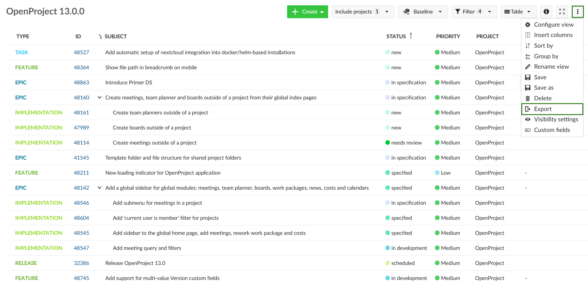

This will open a dialog where you can select the desired format. Click on one of the possible formats to start the export. Below, we will detail how to adjust which data should be exported as well as what the various formats contain.

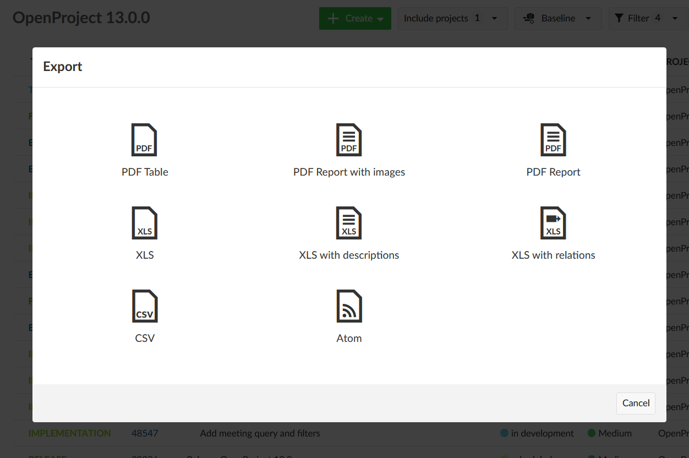

## Export contents

All work packages that are included in the work package table in the currently selected view will be exported, unless a certain export limit has been defined by the instance administrator. The limit can be changed in the [work package settings](../../../system-admin-guide/system-settings/general-settings/#general-system-settings) in the system administration. Newly created instances have a maximum of 500 work packages set as a limit by default.

> **Note**: PDF export options includes all of the work packages in the selected work package table, regardless of the limit. The possible export limit is relevant for XLS, CSV and Atom export options.

**Columns**

The exported file will display the columns that are activated for the work package table. By adding or removing specific columns you can control the columns that will be included into the exported file. Please make sure to [save the work package view](../work-package-table-configuration/#save-work-package-views) you configured for the changes to be included into the report.

Some formats such as PDF will limit the number of columns available due to limitations of the PDF rendering engine to avoid overflowing the available space.

## Export format options
OpenProject has multiple options of exporting work packages, including PDF, XLS, CSV and Atom. See below what each format entails.

## PDF export

OpenProject has multiple options of exporting work packages in PDF format.

### PDF Table 
PDF Table exports the work package table displaying work packages as single rows with the selected columns for the work package table. Work packages IDs are linked to the respective work packages. Clicking on a work package ID will lead you directly to the work package in OpenProject.

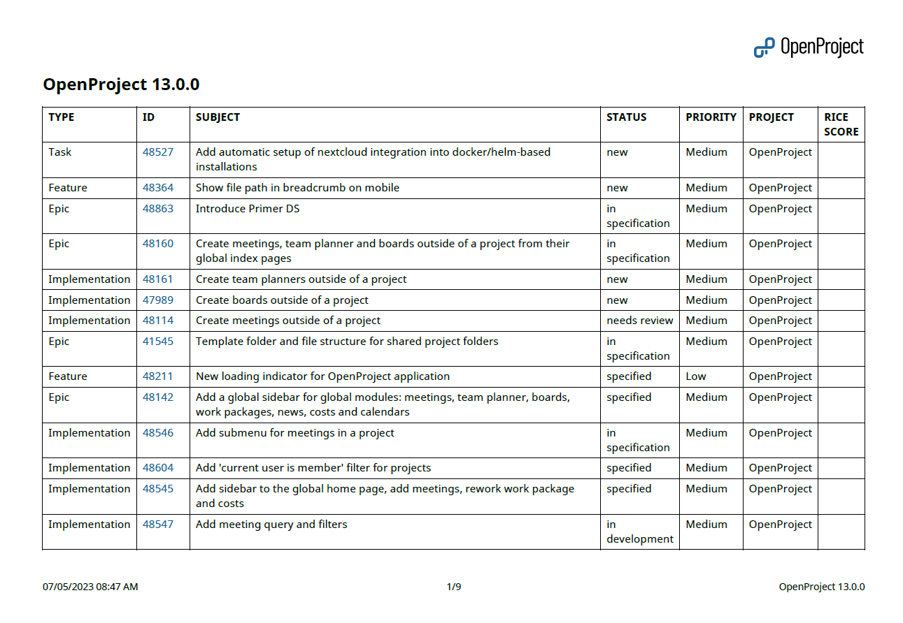

### PDF Report
With PDF Reports you can export detailed up to date work plans for your project in a clean and practical format. It includes a title page, a table of contents (listing all of the work packages), followed by the description of single work packages in a block form. Table of contents is clickable and is linked to the respective pages within the report, making navigation much easier. For each work package a table of attributes is included (attributes correspond to the columns in the work package table). Work package ID attribute is clickable and linked directly to the respective work package in OpenProject.

> **Note**: If ["display sums" is activated](../work-package-table-configuration/) in the work package table, then the sum table is included between table of contents and work packages description in an Overview section.

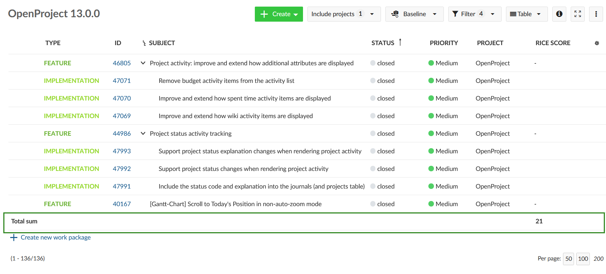

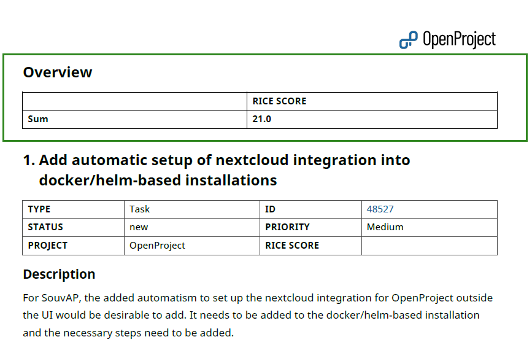

### PDF Report with images
PDF Report with images is the same as PDF Report, but also includes the images from the work package description. 

> **Note**: Images attached or linked in the work package Files section or in the Activity comments are not included into the PDF Report with images. 

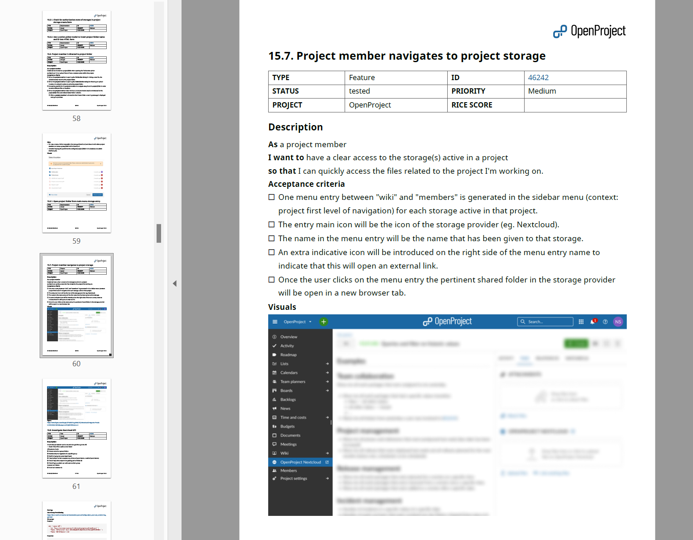

## Excel (XLS) export

> **Note**: To open XLS exported files into Microsoft Excel, ensure you set the encoding to UTF-8. Excel will not auto-detect the encoding or ask you to specify it, but simply open with a wrong encoding under Microsoft Windows.

OpenProject can export the table for Microsoft Excel with the following options:

### XLS  
**XLS** is a plain sheet that matches the OpenProject work packages table with its columns and work packages as rows matching the selected filter(s).

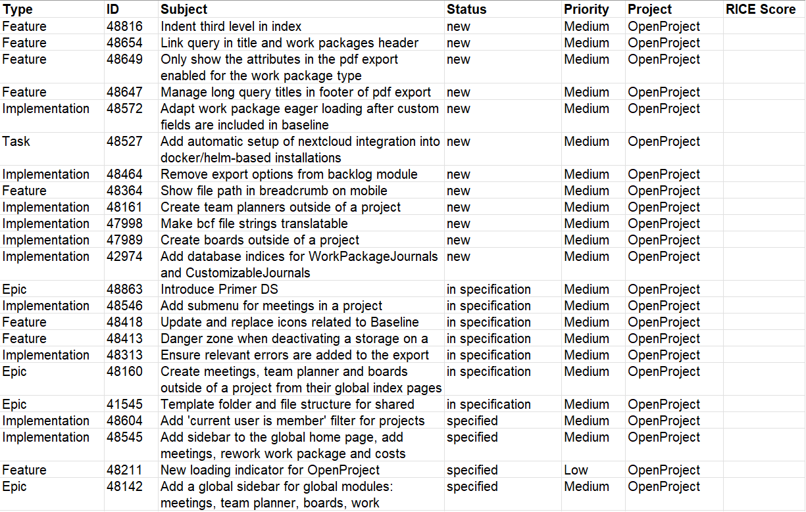

### XLS with descriptions
**XLS with descriptions** is same as above, but with an additional column for work package descriptions, which cannot be selected in the table.

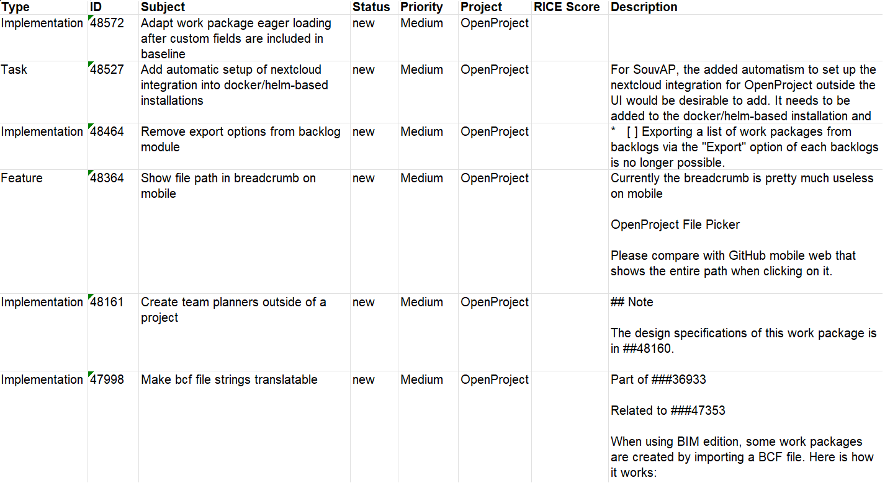

### XLS with relations
**XLS with relations** same as **XLS**, but with additional columns to list each work package relation in a separate row with the relation target and its ID and relation type included in the export.

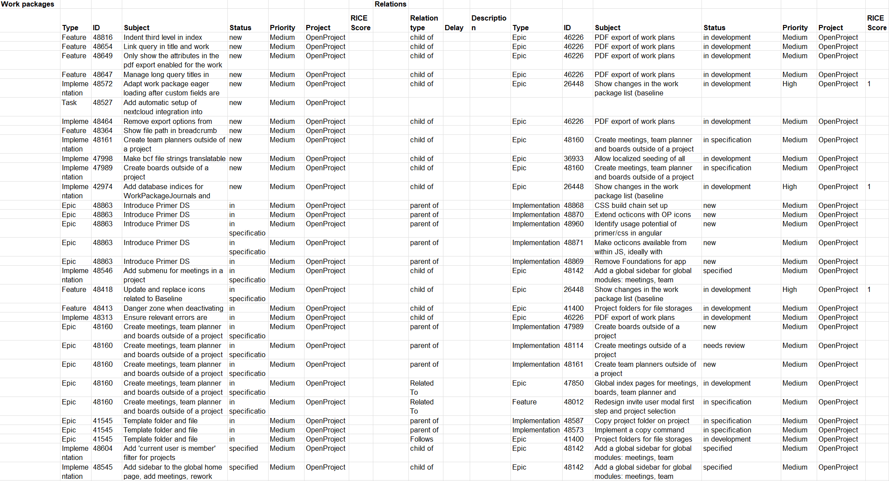

### Limitations

The OpenProject XLS export currently does not respect all options in the work package view being exported form:

- The order of work packages in a manually sorted query is not respected. This is known limitation (Ticket https://community.openproject.org/projects/openproject/work_packages/34971/activity)
- The hierarchy of work packages as displayed in the work package view. The exported XLS is always in "flat" mode.

## CSV export

OpenProject can export the table into a comma-separated CSV. This file will be UTF-8 encoded.

> **Note**: To open CSV exported files into Microsoft Excel, ensure you set the encoding to UTF-8. Excel will not auto-detect the encoding or ask you to specify it, but simply open with a wrong encoding under Microsoft Windows.

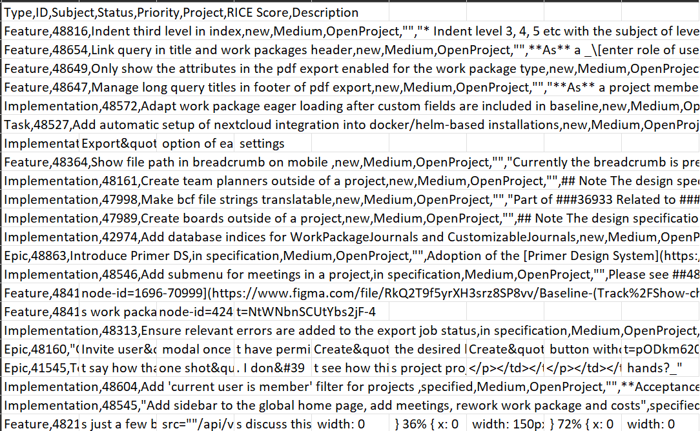

### Limitations

The OpenProject CSV export currently does not respect all options in the work package view being exported form:

- The order of work packages in a manually sorted query is not respected. This is known limitation (Ticket https://community.openproject.org/projects/openproject/work_packages/34971/activity)
- The hierarchy of work packages as displayed in the work package view. The exported CSV is always in "flat" mode.

## Atom (XML) export

OpenProject can export the table into a XML-based atom format. This file will be UTF-8 encoded.

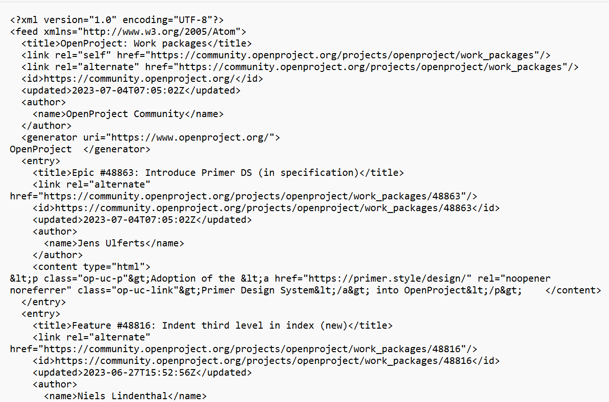

## Export single work packages

It is also possible to export single work packages in PDF and Atom format. To do that click on the settings icon in the top right corner and select the preferred format from the dropdown menu.

