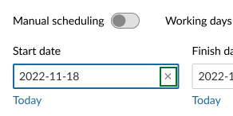
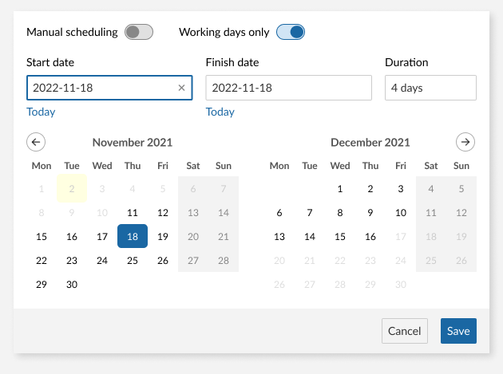

---
sidebar_navigation:
  title: Set and change dates
  priority: 890
description: How to use the date picker to set and update start and finish of work packages
keywords: date picker start finish dates change modify update relations work package
---

# Set and change start and finish dates of work packages

| Feature                                                      | Documentation for                                         |
| ------------------------------------------------------------ | --------------------------------------------------------- |
| [Set start and finish dates](#set-start-and-finish-dates)    | How to set start and finish dates, and how to change them |
| [Scheduling mode](#scheduling-mode)                          | Enabling manual scheduling and what it does               |
| [Warning and information banners](#warning-and-information-banner) | What the different warning and information banners mean   |

## Set start and finish dates

You can change the start and finish dates of work packages opening the date picker. 

1. [Manual scheduling](#scheduling-mode) checkbox
2. Start and finish date input fields
3. Mini calendars for date range preview
4. Save and cancel buttons

You can open the date picker for a work package from a number of different places:

- By clicking on the date field in the work package [details view](../../work-packages/work-package-views/#work-package-full-screen-view)
- By clicking the the date field in the work pacakge [split screen view](../../work-packages/work-package-views/#work-package-split-screen-view) (from any other view, including [notification center](../../notifications), [team planner](../../team-planner/), [boards](../../agile-boards)...)
- By clicking the start or finish date fields in [list view](../../work-packages/work-package-views/#work-package-list-view)

### Using the date picker

You can enter dates either by typing them in into the start and finish date fields or by clicking on individual dates in the mini calendar below.

> **Note**: Typed dates need to be in the standard ISO 8601 format: **YYYY-MM-DD** (so 12 October 2022 would be 2022-10-12). 
>
> They will nevertheless be displayed in your desired format (usually depending by your region or language).

You can also click on the **Today** link below the start and finish date fields to use today's date.

A more intuitive way to select start and end dates is to simply click on two different dates in the mini calendars below. Two calendar months are displayed to give you more visibility. 

Start by clicking on a start date. This will enter the selected date as the start date,  mark it with a dark color on the calendar and move the focus automatically to the finish date. Hovering on different finish dates will give you a preview of which dates are  included if you click. Once you have decided on a finish date, click on it to select it. This will enter the finish date in the date field and mark the end date with another dark color.

 To confirm the selected dates, click on the **Save** button. The green message on top of the work package indicates a successful update.

To clear a date field, simply click on the **clear icon** ("×") icon when the field is in focus.

Date changes are documented in the work package [Activity](../../../getting-started/work-packages-introduction/#activity-of-work-packages).

### Advanced functionality

- The date picker allows you to  pick start and finish dates in the opposite order. Clicking on a start date and then moving backwards to click on an earlier date will then  use that first date as the finish date and the second (earlier) date as the start date. 

- Once you have selected your start and finish dates, you can adjust either field without resetting the other by clicking on a new date near the previously selected date. This, however, depends on which date field is in focus. 

  For example, clicking on a new start date that is 2 days earlier when the start date field is in focus simply replaces the original start date (conserving the finish date). However,  clicking on that same date when the finish date field is in focus clears the finish date and uses the clicked date as the new start date. A second click then allows to select  the new finish date. 

### One-day events

If you want the work package to start and end on the same date, simply click the same date twice.

Work packages with *only* a start date or only a finish date are automatically considered as one-day events. 

Certain work package types (such as Milestones) can only span one day and thus only have one date field:

## Scheduling mode

### Manual scheduling

Checking  "Manual scheduling" enables [manual scheduling mode](../../gantt-chart/scheduling#manual-scheduling-mode) for the work package. This ignores work package relations such that you're able to select any start and end dates, even ones that would normally be restricted due to follows/proceeds relationships. 

Manual scheduling also decouples the start and end dates of parent and children work packages. This means that the dates of parents are no longer constrained by those of the children, and children can be scheduled outside of the range of parent work packages.

Manual scheduling can be useful when you need to anchor a work package on fixed dates, for example because the dates of preceeding or following work packages are not yet known. 

## Information and warning banners

OpenProject 12.2 introduced helpful banners to give you important contextual information when changing dates on work packages with [relations](../../work-packages/work-package-relations-hierarchies).

Information banners have a blue background and display information that is helpful not not critical. Warning banners have an orange background and display information that is critical (with potentially larger consequences to project scheduling).

There are four possible banners:

#### Automatically scheduled

This information banner is displayed when the dates of the current work package are derived from relations and cannot therefore  be modified. This is the case of parent work packages whose start and finish dates are derived from the earliest and latest child work packages respectively. 

It is nevertheless  possible to input specific start and end dates by enabling manual scheduling (and ignoring relations).

### Available start date and finish dates limited by relations.

This information banner is displayed when certain date ranges are disabled due to constraints imposed by follows/preceeds relations. For example, a work packages following another one cannot be scheduled before the finish date of the the preceeding one.

### Manually scheduled, relations ignored

This warning banner is displayed when you enable manual scheduling on work packages that have follows/preceeds or parent/child relations, which are now ignored.

This banner is _not_ displayed when manual scheduling is enabled on work packages without relations.

### Other work packages affected

This warning banner is displayed on work packages whose start and end dates affect those of other related work packages. For example, when changing the finish date can change the start date of the following work package and/or the finish date of a parent.

**Info**: When both an  information and a warning banner are applicable to a work package, only the more important warning banner is displayed.

### Show Relations button

The information and warning banners also feature a **Show Relations** button. Clicking on this will open a new tab that displays work packages with direct relations to the current work package in [Gantt view](../../gantt-chart), in hierarchy mode. 

> **Info**: This preview is intended to give a quick overview of only _direct_ relations that might affect scheduling options for the current work package. It does not show second-level relations (and above). To get a full overview, please use the project work package [list view](../../work-packages/work-package-views/#work-package-list-view) or [Gantt view](../../gantt-chart) with your desired [filter/view configuration](../../work-packages/work-package-table-configuration/).

